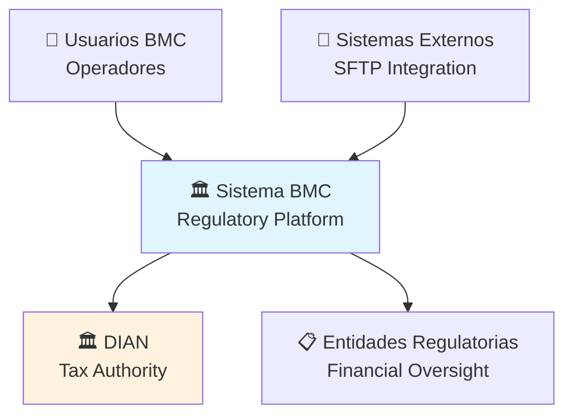
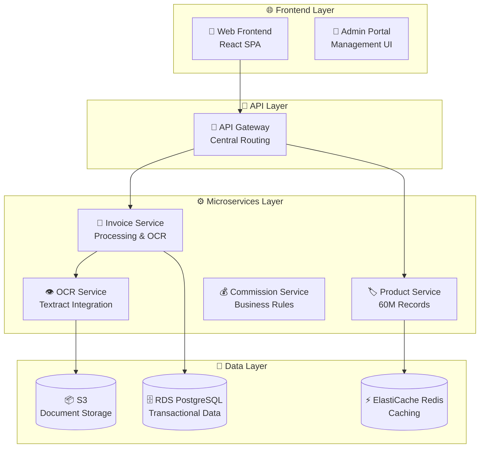
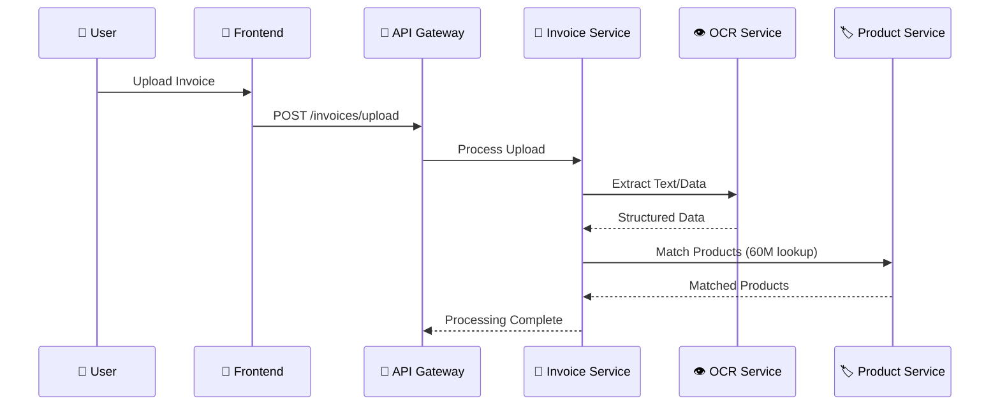
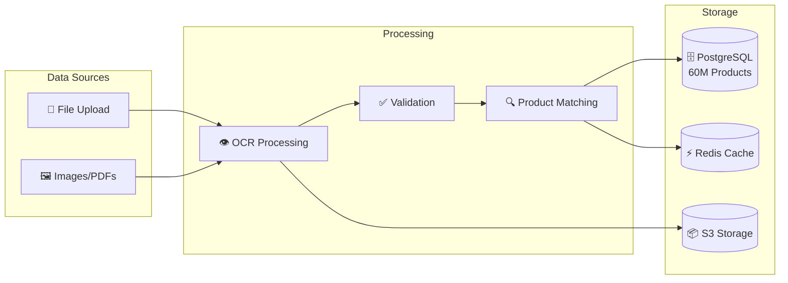
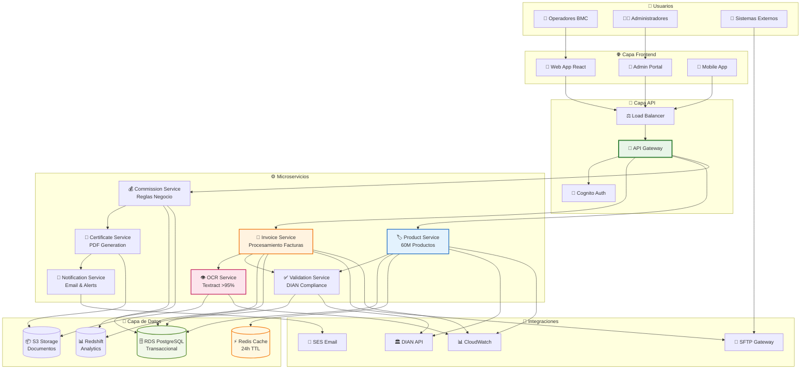
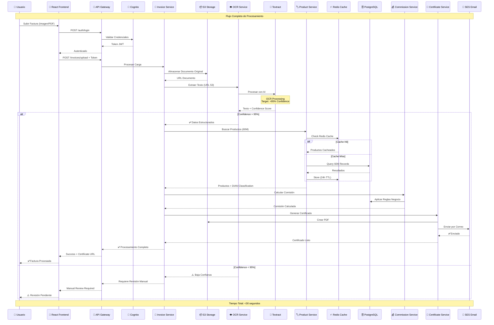
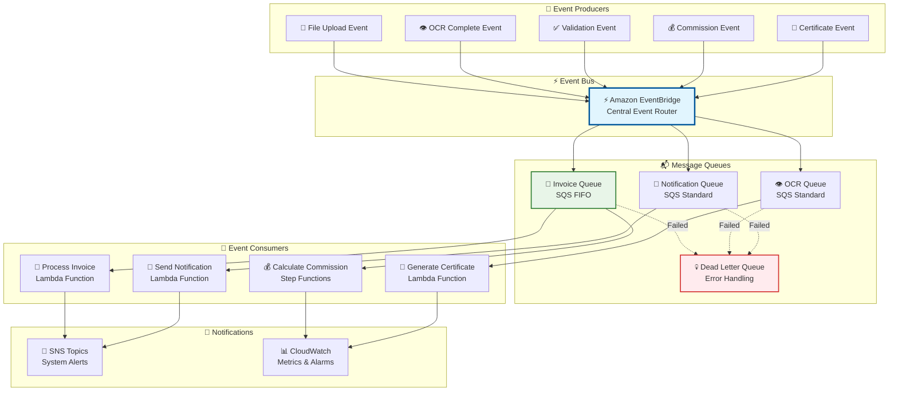

# Diagramas Generados - Arquitectura BMC

## 1. Diagrama de Contexto (C4 Level 1)

## 2. Diagrama de Contenedores (C4 Level 2)

## 3. Diagrama de Secuencia - Procesamiento de Facturas

## 4. Diagrama de Flujo de Datos

## 5. Arquitectura Completa del Sistema BMC

## 6. Flujo de Procesamiento OCR Detallado

## 7. Arquitectura de Eventos (Event-Driven)

## Resumen de Diagramas Generados

✅ **7 Diagramas Mermaid Creados:**
1. **Contexto** - Actores y sistema BMC
2. **Contenedores** - Arquitectura de alto nivel
3. **Secuencia** - Flujo de procesamiento
4. **Flujo de Datos** - Pipeline de información
5. **Arquitectura Completa** - Vista integral del sistema
6. **OCR Detallado** - Procesamiento con >95% precisión
7. **Eventos** - Arquitectura event-driven

**Características:**
- 📊 Visualización interactiva con emojis
- 🎯 Métricas de performance integradas
- 🔄 Flujos de datos claramente definidos
- ⚡ Arquitectura event-driven con AWS services
- 🏛️ Compliance DIAN y regulatorio
- 📈 Escalabilidad para 60M productos
