# Propuesta de Arquitectura BMC - AWS Migration

## Modelo C4 - Context, Containers, Components, Code

### Nivel 1: Context Diagram

```mermaid
graph TB
    Users[👥 Usuarios BMC<br/>Operadores]
    External[🏢 Sistemas Externos<br/>SFTP Integration]
    Operators[👨‍💼 Operadores<br/>Bolsa Comisionista]
    
    BMC[🏛️ Sistema BMC<br/>Regulatory Platform]
    
    DIAN[🏛️ DIAN<br/>Tax Authority]
    Regulatory[📋 Entidades Regulatorias<br/>Financial Oversight]
    Reports[📊 Reportes Regulatorios<br/>Compliance Reports]
    
    Users --> BMC
    External --> BMC
    Operators --> BMC
    
    BMC --> DIAN
    BMC --> Regulatory
    BMC --> Reports
    
    style BMC fill:#e1f5fe
    style DIAN fill:#fff3e0
    style Regulatory fill:#f3e5f5
```



### Nivel 2: Container Diagram

```mermaid
graph TB
    subgraph "👥 Users"
        WebUser[Web Users]
        MobileUser[Mobile Users]
        AdminUser[Admin Users]
    end
    
    subgraph "🌐 Frontend Layer"
        WebApp[📱 Web Frontend<br/>React SPA]
        MobileApp[📱 Mobile App<br/>React Native]
        AdminPortal[🔧 Admin Portal<br/>Management UI]
    end
    
    subgraph "🚪 API Layer"
        APIGateway[🚪 API Gateway<br/>Central Routing]
        Auth[🔐 Authentication<br/>Cognito]
    end
    
    subgraph "⚙️ Microservices Layer"
        InvoiceService[📄 Invoice Service<br/>Processing & OCR]
        ProductService[🏷️ Product Service<br/>60M Records]
        OCRService[👁️ OCR Service<br/>Textract Integration]
        CommissionService[💰 Commission Service<br/>Business Rules]
        CertificateService[📜 Certificate Service<br/>PDF Generation]
        ValidationService[✅ Validation Service<br/>Two-Layer Validation]
        NotificationService[📧 Notification Service<br/>Email & Alerts]
    end
    
    subgraph "💾 Data Layer"
        RDS[(🗄️ RDS PostgreSQL<br/>Transactional Data)]
        Redshift[(📊 Redshift<br/>Analytics)]
        Redis[(⚡ ElastiCache Redis<br/>Caching)]
        S3[(📦 S3<br/>Document Storage)]
    end
    
    subgraph "🔗 External Integrations"
        SFTP[📁 SFTP Gateway<br/>Transfer Family]
        Email[📧 Email Service<br/>SES]
        DIANApi[🏛️ DIAN API<br/>Classification]
    end
    
    WebUser --> WebApp
    MobileUser --> MobileApp
    AdminUser --> AdminPortal
    
    WebApp --> APIGateway
    MobileApp --> APIGateway
    AdminPortal --> APIGateway
    
    APIGateway --> Auth
    APIGateway --> InvoiceService
    APIGateway --> ProductService
    APIGateway --> CommissionService
    
    InvoiceService --> OCRService
    InvoiceService --> ValidationService
    ProductService --> Redis
    CommissionService --> CertificateService
    CertificateService --> NotificationService
    
    InvoiceService --> RDS
    ProductService --> RDS
    CommissionService --> RDS
    OCRService --> S3
    
    ProductService --> Redshift
    CommissionService --> Redshift
    
    NotificationService --> Email
    InvoiceService --> SFTP
    ProductService --> DIANApi
    
    style APIGateway fill:#e8f5e8
    style InvoiceService fill:#fff3e0
    style ProductService fill:#e3f2fd
    style OCRService fill:#fce4ec
```



### Nivel 3: Component Diagram - Microservices Detail

#### Invoice Service Components

```mermaid
graph TB
    subgraph "📄 Invoice Service"
        FileHandler[📁 File Upload Handler<br/>Multi-format Support]
        OCRProcessor[👁️ OCR Document Processor<br/>Image & PDF Processing]
        BatchEngine[⚙️ Batch Processing Engine<br/>Queue Management]
        Validator[✅ Invoice Validator<br/>Data Validation]
        RulesEngine[🧠 Business Rules Engine<br/>Commission Logic]
        StatusTracker[📊 Status Tracker<br/>Processing Status]
        
        FileHandler --> OCRProcessor
        OCRProcessor --> Validator
        Validator --> RulesEngine
        RulesEngine --> StatusTracker
        BatchEngine --> FileHandler
    end
    
    subgraph "External Dependencies"
        S3Storage[(📦 S3 Storage)]
        SQSQueue[📬 SQS Queue]
        EventBridge[⚡ EventBridge]
    end
    
    FileHandler --> S3Storage
    BatchEngine --> SQSQueue
    StatusTracker --> EventBridge
    
    style FileHandler fill:#e8f5e8
    style OCRProcessor fill:#fce4ec
    style RulesEngine fill:#fff3e0
```



#### Product Service Components

```mermaid
graph TB
    subgraph "🏷️ Product Service (60M Records)"
        LookupEngine[🔍 Product Lookup Engine<br/>High-Performance Search]
        DIANMatcher[🏛️ DIAN Classification Matcher<br/>Regulatory Compliance]
        CacheManager[⚡ Cache Manager<br/>Redis Integration]
        ProductAPI[🔌 Product List API<br/>Frontend Integration]
        SearchEngine[🔎 Search & Filter Engine<br/>Advanced Queries]
        DataSync[🔄 Data Synchronizer<br/>Real-time Updates]
        
        ProductAPI --> LookupEngine
        LookupEngine --> CacheManager
        LookupEngine --> SearchEngine
        SearchEngine --> DIANMatcher
        DIANMatcher --> DataSync
    end
    
    subgraph "Data Sources"
        PostgreSQL[(🗄️ PostgreSQL<br/>60M Products)]
        RedisCache[(⚡ Redis Cache<br/>24h TTL)]
        DIANService[🏛️ DIAN Service<br/>External API]
    end
    
    LookupEngine --> PostgreSQL
    CacheManager --> RedisCache
    DIANMatcher --> DIANService
    
    style LookupEngine fill:#e3f2fd
    style CacheManager fill:#f1f8e9
    style DIANMatcher fill:#fff3e0
```



#### OCR Processing Service Components

```mermaid
graph TB
    subgraph "👁️ OCR Processing Service"
        ImagePreprocessor[🖼️ Image Preprocessor<br/>Quality Enhancement]
        PDFExtractor[📄 PDF Text Extractor<br/>Text Extraction]
        TextractIntegration[🤖 Textract Integration<br/>AWS AI Service]
        AccuracyValidator[✅ Accuracy Validator<br/>>95% Confidence]
        FormatConverter[🔄 Format Converter<br/>Standardization]
        QualityAssurance[🎯 Quality Assurance Engine<br/>Manual Review Queue]
        
        ImagePreprocessor --> TextractIntegration
        PDFExtractor --> TextractIntegration
        TextractIntegration --> AccuracyValidator
        AccuracyValidator --> FormatConverter
        AccuracyValidator --> QualityAssurance
    end
    
    subgraph "AWS Services"
        Textract[🤖 Amazon Textract<br/>OCR Service]
        S3Documents[(📦 S3 Documents<br/>Storage)]
        CloudWatch[📊 CloudWatch<br/>Monitoring]
    end
    
    TextractIntegration --> Textract
    ImagePreprocessor --> S3Documents
    AccuracyValidator --> CloudWatch
    
    style TextractIntegration fill:#fce4ec
    style AccuracyValidator fill:#e8f5e8
    style QualityAssurance fill:#fff3e0
```



### Nivel 4: Sequence Diagrams - Process Flows

#### Invoice Processing Flow

```mermaid
sequenceDiagram
    participant User as 👤 User
    participant Frontend as 📱 Frontend
    participant API as 🚪 API Gateway
    participant Invoice as 📄 Invoice Service
    participant OCR as 👁️ OCR Service
    participant Product as 🏷️ Product Service
    participant Commission as 💰 Commission Service
    participant Certificate as 📜 Certificate Service
    
    User->>Frontend: Upload Invoice (Image/PDF)
    Frontend->>API: POST /invoices/upload
    API->>Invoice: Process Upload
    Invoice->>OCR: Extract Text/Data
    OCR-->>Invoice: Structured Data (>95% confidence)
    Invoice->>Product: Match Products (60M lookup)
    Product-->>Invoice: Matched Products + DIAN Classification
    Invoice->>Commission: Calculate Commission
    Commission-->>Invoice: Commission Details
    Invoice->>Certificate: Generate Certificate
    Certificate-->>Invoice: PDF Certificate
    Invoice-->>API: Processing Complete
    API-->>Frontend: Success Response
    Frontend-->>User: Certificate Ready
```



#### Product Lookup Flow (60M Records)

```mermaid
sequenceDiagram
    participant API as 🚪 API Gateway
    participant Product as 🏷️ Product Service
    participant Cache as ⚡ Redis Cache
    participant DB as 🗄️ PostgreSQL (60M)
    participant DIAN as 🏛️ DIAN API
    
    API->>Product: Search Products
    Product->>Cache: Check Cache
    alt Cache Hit
        Cache-->>Product: Cached Results
    else Cache Miss
        Product->>DB: Query 60M Records
        DB-->>Product: Search Results
        Product->>Cache: Store Results (24h TTL)
    end
    Product->>DIAN: Validate Classification
    DIAN-->>Product: Classification Confirmed
    Product-->>API: Product List + Classification
```



### Architecture Decision Records (ADR)

#### ADR-001: Event-Driven Architecture

```mermaid
graph LR
    subgraph "Event Sources"
        Upload[📁 File Upload]
        OCRComplete[👁️ OCR Complete]
        ValidationDone[✅ Validation Done]
    end
    
    subgraph "Event Bus"
        EventBridge[⚡ Amazon EventBridge]
    end
    
    subgraph "Event Consumers"
        ProcessInvoice[📄 Process Invoice]
        CalculateCommission[💰 Calculate Commission]
        GenerateCertificate[📜 Generate Certificate]
        SendNotification[📧 Send Notification]
    end
    
    Upload --> EventBridge
    OCRComplete --> EventBridge
    ValidationDone --> EventBridge
    
    EventBridge --> ProcessInvoice
    EventBridge --> CalculateCommission
    EventBridge --> GenerateCertificate
    EventBridge --> SendNotification
    
    style EventBridge fill:#e1f5fe
```



#### ADR-002: Data Architecture Strategy

```mermaid
graph TB
    subgraph "Transactional Layer"
        RDS[(🗄️ RDS PostgreSQL<br/>OLTP - 60M Products)]
    end
    
    subgraph "Caching Layer"
        Redis[(⚡ ElastiCache Redis<br/>Product Lookups)]
    end
    
    subgraph "Analytics Layer"
        Redshift[(📊 Redshift<br/>OLAP - Reporting)]
    end
    
    subgraph "Document Storage"
        S3[(📦 S3<br/>Images, PDFs, Certificates)]
    end
    
    subgraph "ETL Pipeline"
        Glue[🔄 AWS Glue<br/>Data Pipeline]
    end
    
    RDS --> Redis
    RDS --> Glue
    Glue --> Redshift
    S3 --> Glue
    
    style RDS fill:#e3f2fd
    style Redis fill:#f1f8e9
    style Redshift fill:#fff3e0
    style S3 fill:#fce4ec
```



## Definiciones de Desarrollo

### Stack Tecnológico

#### Backend Services
```yaml
Language: Python 3.9+
Framework: FastAPI
Architecture: Event-Driven Microservices
Containerization: Docker + ECS Fargate
Orchestration: AWS Step Functions
API Documentation: OpenAPI/Swagger
Testing: pytest + coverage >90%
```

#### Frontend Applications
```yaml
Framework: React 18+ with TypeScript
State Management: Redux Toolkit + RTK Query
UI Library: Material-UI v5
Build Tool: Vite
Testing: Jest + React Testing Library
E2E Testing: Playwright
```

#### Development Standards
```yaml
Code Style: 
  - Python: PEP 8 + Black formatter
  - TypeScript: ESLint + Prettier
  - SQL: snake_case naming

Git Workflow: GitFlow
Branch Protection: Required PR reviews
CI/CD: GitHub Actions + AWS CodePipeline
Code Quality: SonarQube integration
```

### Microservices Architecture

#### Service Communication
```yaml
Synchronous: REST APIs via API Gateway
Asynchronous: EventBridge + SQS
Service Mesh: AWS App Mesh (optional)
Circuit Breaker: AWS Lambda built-in retry
Load Balancing: Application Load Balancer
```

#### Error Handling & Resilience
```yaml
Retry Strategy: Exponential backoff
Dead Letter Queues: SQS DLQ for failed messages
Health Checks: /health endpoints
Monitoring: CloudWatch + X-Ray tracing
Alerting: SNS + CloudWatch Alarms
```

## Definiciones de Base de Datos

### Arquitectura de Datos Multi-Tier

#### Transactional Layer - RDS PostgreSQL
```sql
-- Core Tables Structure
CREATE SCHEMA bmc_transactional;

-- Products table (60M records)
CREATE TABLE bmc_transactional.products (
    product_id BIGSERIAL PRIMARY KEY,
    product_code VARCHAR(50) UNIQUE NOT NULL,
    product_name VARCHAR(255) NOT NULL,
    dian_classification VARCHAR(20) NOT NULL,
    category_id INTEGER NOT NULL,
    unit_type VARCHAR(20) NOT NULL,
    created_at TIMESTAMP DEFAULT CURRENT_TIMESTAMP,
    updated_at TIMESTAMP DEFAULT CURRENT_TIMESTAMP
);

-- Invoices table (partitioned by month)
CREATE TABLE bmc_transactional.invoices (
    invoice_id BIGSERIAL PRIMARY KEY,
    invoice_number VARCHAR(100) NOT NULL,
    invoice_date DATE NOT NULL,
    document_type VARCHAR(20) NOT NULL, -- 'PDF', 'IMAGE', 'XML'
    document_path VARCHAR(500),
    ocr_confidence DECIMAL(5,2), -- OCR accuracy percentage
    processing_status VARCHAR(20) DEFAULT 'PENDING',
    created_at TIMESTAMP DEFAULT CURRENT_TIMESTAMP
) PARTITION BY RANGE (invoice_date);

-- Invoice items
CREATE TABLE bmc_transactional.invoice_items (
    item_id BIGSERIAL PRIMARY KEY,
    invoice_id BIGINT REFERENCES bmc_transactional.invoices(invoice_id),
    product_id BIGINT REFERENCES bmc_transactional.products(product_id),
    quantity DECIMAL(15,4) NOT NULL,
    unit_price DECIMAL(15,4) NOT NULL,
    total_amount DECIMAL(15,4) NOT NULL,
    validation_status VARCHAR(20) DEFAULT 'PENDING'
);

-- Commissions
CREATE TABLE bmc_transactional.commissions (
    commission_id BIGSERIAL PRIMARY KEY,
    invoice_id BIGINT REFERENCES bmc_transactional.invoices(invoice_id),
    commission_rate DECIMAL(8,6) NOT NULL,
    commission_amount DECIMAL(15,4) NOT NULL,
    calculation_date TIMESTAMP DEFAULT CURRENT_TIMESTAMP,
    business_rule_version VARCHAR(20) NOT NULL
);
```

#### Analytical Layer - Redshift
```sql
-- Data Warehouse Schema
CREATE SCHEMA bmc_analytics;

-- Fact table for commissions
CREATE TABLE bmc_analytics.fact_commissions (
    commission_key BIGINT IDENTITY(1,1) PRIMARY KEY,
    invoice_key BIGINT NOT NULL,
    product_key BIGINT NOT NULL,
    date_key INTEGER NOT NULL,
    commission_amount DECIMAL(15,4) NOT NULL,
    commission_rate DECIMAL(8,6) NOT NULL,
    quantity DECIMAL(15,4) NOT NULL,
    total_invoice_amount DECIMAL(15,4) NOT NULL
) DISTKEY(date_key) SORTKEY(date_key);

-- Dimension tables
CREATE TABLE bmc_analytics.dim_products (
    product_key BIGINT IDENTITY(1,1) PRIMARY KEY,
    product_code VARCHAR(50) NOT NULL,
    product_name VARCHAR(255) NOT NULL,
    dian_classification VARCHAR(20) NOT NULL,
    category_name VARCHAR(100) NOT NULL
) DISTSTYLE ALL;

CREATE TABLE bmc_analytics.dim_time (
    date_key INTEGER PRIMARY KEY,
    full_date DATE NOT NULL,
    year INTEGER NOT NULL,
    quarter INTEGER NOT NULL,
    month INTEGER NOT NULL,
    day INTEGER NOT NULL,
    week_of_year INTEGER NOT NULL
) DISTSTYLE ALL;
```

#### Caching Layer - ElastiCache Redis
```yaml
Cache Strategy:
  Product Lookups:
    TTL: 24 hours
    Pattern: "product:{product_code}"
    Size: ~2GB for 60M products metadata
  
  DIAN Classifications:
    TTL: 7 days
    Pattern: "dian:{classification_code}"
    Size: ~100MB
  
  User Sessions:
    TTL: 30 minutes
    Pattern: "session:{user_id}"
    Size: ~10MB total
```

### Database Performance Optimization

#### Indexing Strategy
```sql
-- Products table indexes
CREATE INDEX idx_products_code ON bmc_transactional.products(product_code);
CREATE INDEX idx_products_dian ON bmc_transactional.products(dian_classification);
CREATE INDEX idx_products_category ON bmc_transactional.products(category_id);

-- Invoices table indexes
CREATE INDEX idx_invoices_date ON bmc_transactional.invoices(invoice_date);
CREATE INDEX idx_invoices_status ON bmc_transactional.invoices(processing_status);
CREATE INDEX idx_invoices_number ON bmc_transactional.invoices(invoice_number);

-- Composite indexes for common queries
CREATE INDEX idx_invoice_items_lookup ON bmc_transactional.invoice_items(invoice_id, product_id);
```

#### Partitioning Strategy
```sql
-- Monthly partitions for invoices (last 24 months + future 12 months)
CREATE TABLE bmc_transactional.invoices_2024_01 PARTITION OF bmc_transactional.invoices
    FOR VALUES FROM ('2024-01-01') TO ('2024-02-01');

CREATE TABLE bmc_transactional.invoices_2024_02 PARTITION OF bmc_transactional.invoices
    FOR VALUES FROM ('2024-02-01') TO ('2024-03-01');
-- ... continue for all months
```

## Integraciones con Plataformas

### AWS Services Integration

#### Document Processing Pipeline
```yaml
S3 Bucket Structure:
  - bmc-documents-raw/
    - invoices/images/
    - invoices/pdfs/
    - certificates/generated/
  
  - bmc-documents-processed/
    - ocr-results/
    - validated-documents/
    - archived/

Textract Integration:
  - Async processing for large documents
  - Confidence threshold: 95%
  - Custom forms analysis for invoice structure
  - Multi-language support (Spanish)

Lambda Functions:
  - document-preprocessor
  - ocr-processor
  - validation-engine
  - format-converter
```

#### Event-Driven Architecture
```yaml
EventBridge Rules:
  - invoice.uploaded → trigger OCR processing
  - invoice.processed → trigger validation
  - validation.completed → trigger commission calculation
  - commission.calculated → trigger certificate generation

SQS Queues:
  - invoice-processing-queue (FIFO)
  - ocr-processing-queue (Standard)
  - notification-queue (Standard)
  - dead-letter-queue (Error handling)

SNS Topics:
  - invoice-events
  - system-alerts
  - user-notifications
```

### External System Integrations

#### SFTP Integration - AWS Transfer Family
```yaml
Configuration:
  Protocol: SFTP
  Identity Provider: Service Managed
  Endpoint Type: VPC
  Security: VPC Security Groups + NACLs

Directory Structure:
  /incoming/
    - daily-reports/
    - regulatory-filings/
  /outgoing/
    - commission-reports/
    - compliance-documents/
  /archive/
    - processed-files/

Automation:
  - Lambda trigger on file upload
  - Automatic file validation
  - Processing status notifications
  - Archive after 30 days
```

#### DIAN API Integration
```yaml
Authentication: OAuth 2.0 + Client Credentials
Rate Limiting: 1000 requests/hour
Retry Strategy: Exponential backoff
Endpoints:
  - /classification/validate
  - /products/lookup
  - /compliance/check

Error Handling:
  - Circuit breaker pattern
  - Fallback to cached data
  - Manual review queue for failures
```

#### Email Service - Amazon SES
```yaml
Configuration:
  Domain: bmc.gov.co (verified)
  DKIM: Enabled
  Bounce/Complaint Handling: Configured

Templates:
  - certificate-delivery
  - processing-notification
  - error-alert
  - compliance-report

Delivery:
  - Immediate: Critical alerts
  - Batched: Daily reports
  - Scheduled: Weekly summaries
```

### Security & Compliance Integration

#### IAM Roles & Policies
```yaml
Service Roles:
  - BMC-InvoiceService-Role
  - BMC-ProductService-Role
  - BMC-OCRService-Role
  - BMC-DataAccess-Role

User Roles:
  - BMC-Admin (full access)
  - BMC-Operator (read/write invoices)
  - BMC-Viewer (read-only reports)
  - BMC-External (SFTP access only)

Policies:
  - Least privilege principle
  - Resource-based permissions
  - Time-based access (business hours)
  - IP restriction for admin access
```

#### Monitoring & Compliance
```yaml
CloudTrail:
  - All API calls logged
  - Data events for S3 buckets
  - Management events for all services

CloudWatch:
  - Custom metrics for business KPIs
  - Log aggregation from all services
  - Real-time dashboards
  - Automated alerting

Compliance:
  - Data residency: Colombia region only
  - Encryption: AES-256 at rest, TLS 1.3 in transit
  - Audit trail: 7-year retention
  - Access logging: All data access recorded
```

## Cronograma de Implementación

### Fase 1: Fundación (Semanas 1-8)
- Setup AWS environment
- Database migration (60M products)
- Product Service implementation
- Basic API Gateway setup

### Fase 2: Procesamiento (Semanas 9-16)
- OCR Service implementation
- Invoice Service development
- Document processing pipeline
- Textract integration

### Fase 3: Lógica de Negocio (Semanas 17-22)
- Commission Service
- Validation Service
- Business rules engine
- Step Functions workflows

### Fase 4: Integración (Semanas 23-26)
- Certificate Service
- SFTP Gateway setup
- Email service integration
- Frontend migration

### Fase 5: Optimización (Semanas 27-30)
- Performance tuning
- Security hardening
- Compliance validation
- Go-live preparation

## Métricas de Éxito

### Performance KPIs
- OCR Processing: <5 segundos (imágenes), <3 segundos (PDFs)
- Product Lookup: <500ms (60M records)
- Invoice Processing: <3 segundos (individual), <30 minutos (lotes)
- System Availability: >99.9%

### Business KPIs
- OCR Accuracy: >95%
- Processing Throughput: 10,000 invoices/hour
- Compliance Rate: 100% DIAN validation
- User Satisfaction: >4.5/5.0
