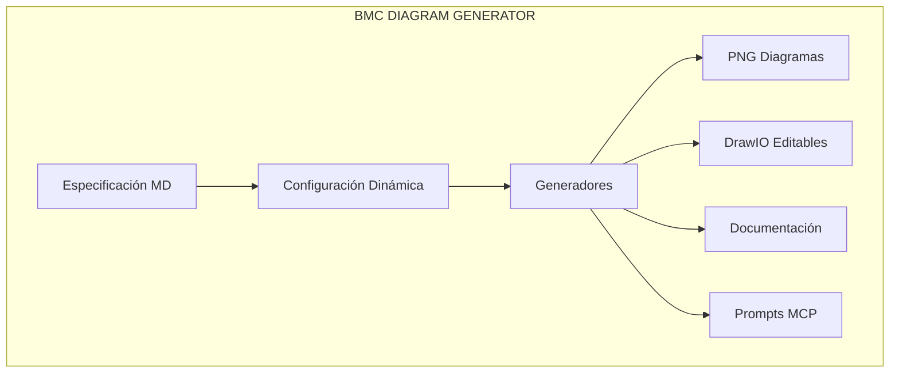

# 🚀 BMC Diagram Generator v4.1.0

**Sistema profesional para generación automática de diagramas técnicos y documentación desde especificaciones de proyectos.**

## 📋 Características Principales

- ✅ **Generación automática** desde especificación única
- ✅ **4 diagramas PNG** profesionales nivel AWS Senior Architect
- ✅ **4 diagramas DrawIO** editables con mismo nivel de detalle
- ✅ **Documentación técnica** completa (8 archivos MD)
- ✅ **Prompts MCP** especializados para IA
- ✅ **Configuración dinámica** sin archivos estáticos

## 🎯 Archivos Generados (18 total)

```
outputs/
├── png/bmc_input/                    # 4 diagramas PNG
│   ├── network_architecture.png     # Arquitectura de red Multi-AZ
│   ├── microservices_detailed.png   # Microservicios detallados
│   ├── security_architecture.png    # Seguridad enterprise
│   └── data_flow.png                # Flujo de datos Senior Level
├── drawio/bmc_input/                 # 4 diagramas DrawIO editables
│   ├── complete_architecture.drawio
│   ├── dynamic_architecture_*.drawio
│   └── professional_architecture_*.drawio (2 versiones)
├── prompts/bmc_input/                # 3 prompts MCP
│   ├── architecture_prompt.md
│   ├── implementation_prompt.md
│   └── migration_prompt.md
├── documentation/bmc_input/          # 5 documentos técnicos
│   ├── technical_architecture.md
│   ├── implementation_guide.md
│   ├── migration_plan.md
│   ├── infrastructure_config.md
│   └── bmc_input_report.md
└── generated/                        # 3 configuraciones JSON
    ├── bmc.json
    ├── bmc_input_consolidated.json
    └── bmc_input_results.json
```

## 🚀 Uso Rápido

### **Opción 1: Scripts Bash (Recomendado)**

```bash
# Generar todo desde cero
./generate.sh

# Por secciones
./generate.sh png      # Solo PNG
./generate.sh drawio   # Solo DrawIO
./generate.sh docs     # Solo documentación

# Limpieza
./clean.sh             # Limpiar todo
./clean.sh png         # Solo PNG
./clean.sh status      # Ver estado

# Limpiar y regenerar
./generate.sh clean
```

### **Opción 2: Script Python (Avanzado)**

```bash
# Flujo completo
python run.py --run complete

# Por secciones
python run.py --run config
python run.py --run png
python run.py --run drawio
python run.py --run prompts
python run.py --run docs

# Limpieza
python run.py --clean all
python run.py --clean png

# Combinaciones
python run.py --clean png --run png

# Estado del sistema
python run.py --status
```

## 📦 Instalación

### **1. Clonar Repositorio**
```bash
git clone https://github.com/giovanemere/bmc_propuesta_migracion.git
cd bmc_propuesta_migracion
```

### **2. Configurar Entorno**
```bash
# Crear entorno virtual
python -m venv venv
source venv/bin/activate  # Linux/Mac
# venv\Scripts\activate   # Windows

# Instalar dependencias
pip install -r requirements.txt
```

### **3. Hacer Ejecutables los Scripts**
```bash
chmod +x clean.sh generate.sh
```

### **4. Verificar Instalación**
```bash
./clean.sh status
python run.py --status
```

## 🎯 Casos de Uso Comunes

### **Desarrollo Iterativo**
```bash
# Editar especificación
vim config/bmc-input-specification.md

# Regenerar solo lo necesario
./generate.sh config
./generate.sh png
```

### **Solo Diagramas**
```bash
# Limpiar y regenerar solo diagramas
./clean.sh png drawio
./generate.sh png
./generate.sh drawio
```

### **Verificación Completa**
```bash
# Ver estado detallado
python run.py --status
# Resultado esperado: 18 archivos

# Ver archivos específicos
ls -la outputs/png/bmc_input/
ls -la outputs/drawio/bmc_input/
```

### **Regeneración Completa**
```bash
# Limpiar todo y regenerar desde cero
./generate.sh clean
# o
python run.py --clean all --run complete
```

## 🎨 Nivel de Calidad

### **PNG Diagramas - AWS Senior Architect Level**
- ✅ **Especificaciones técnicas completas** (CPU, memoria, throughput)
- ✅ **Componentes AWS reales** con configuraciones de producción
- ✅ **Patrones enterprise** (Circuit Breaker, DLQ, Multi-AZ)
- ✅ **Observabilidad completa** (X-Ray, CloudWatch, métricas)

### **DrawIO Diagramas - Mismo Nivel que PNG**
- ✅ **4 diagramas profesionales** en tabs separados
- ✅ **Componentes AWS oficiales** (mxgraph.aws4)
- ✅ **Completamente editables** en Draw.io
- ✅ **Especificaciones técnicas** en cada componente
- ✅ **Conexiones etiquetadas** con información técnica

### **Documentación Técnica**
- ✅ **Arquitectura técnica** detallada
- ✅ **Guía de implementación** paso a paso
- ✅ **Plan de migración** GCP → AWS (12 semanas)
- ✅ **Configuración de infraestructura** completa
- ✅ **Prompts MCP** especializados para IA

## 🔧 Configuración

### **Archivo de Especificación**
El sistema lee desde: `config/bmc-input-specification.md`

```markdown
# BMC Input Specification

## Microservicios
- Invoice Service: Procesamiento de facturas...
- Product Service: 60M productos migrados...
- OCR Service: Análisis de PDF con 95% precisión...
```

### **Variables de Entorno**
```bash
export PYTHONPATH="$(pwd)/src:$(pwd):$PYTHONPATH"
export DEBUG=false
export LOG_LEVEL=INFO
```

## 📊 Métricas de Performance

| Operación | Tiempo | Archivos |
|-----------|--------|----------|
| **Flujo completo** | ~10s | 18 archivos |
| **Solo PNG** | ~3s | 4 archivos |
| **Solo DrawIO** | ~2s | 4 archivos |
| **Solo docs** | ~1s | 8 archivos |

## 🛠️ Troubleshooting

### **Error: Módulo no encontrado**
```bash
export PYTHONPATH="$(pwd)/src:$(pwd):$PYTHONPATH"
source venv/bin/activate
```

### **Error: DrawIO no válido**
```bash
# Regenerar DrawIO
./clean.sh drawio
./generate.sh drawio
```
### **Mejoras recomendadas para DrawIO**

- **Validación automática del XML generado:** Integra validación usando la API de diagrams.net o drawio-export antes de guardar los archivos.
- **Preview rápido de diagramas:** Usa drawio-desktop en modo CLI para abrir y revisar los archivos `.drawio` generados.
- **Layouts automáticos:** Aplica layouts horizontales, verticales o en grid para mejorar la legibilidad y evitar solapamientos.
- **Estilos y colores consistentes:** Define estilos por tipo de componente (seguridad, datos, red) para facilitar la interpretación visual.
- **Leyendas y notas explicativas:** Añade leyendas y notas en los diagramas para ayudar a los usuarios a entender la arquitectura.
- **Miniaturas y reportes HTML:** Genera previews HTML con los diagramas embebidos para revisión rápida y feedback visual inmediato.
- **Automatización de pruebas de renderizado:** Implementa tests automáticos para asegurar que los diagramas se pueden abrir y editar correctamente en Draw.io.
- **Ejemplos visuales en la documentación:** Añade screenshots o GIFs en la documentación para mostrar el resultado esperado y facilitar la adopción.

### **Error: Permisos**
```bash
chmod +x clean.sh generate.sh
```

### **Error: Especificación no encontrada**
```bash
ls -la config/bmc-input-specification.md
```

## 📋 Comandos de Referencia Rápida

| Acción | Comando Rápido | Comando Completo |
|--------|----------------|------------------|
| **Generar todo** | `./generate.sh` | `python run.py --run complete` |
| **Limpiar todo** | `./clean.sh` | `python run.py --clean all` |
| **Solo PNG** | `./generate.sh png` | `python run.py --run png` |
| **Solo DrawIO** | `./generate.sh drawio` | `python run.py --run drawio` |
| **Ver estado** | `./clean.sh status` | `python run.py --status` |
| **Limpiar y regenerar** | `./generate.sh clean` | `python run.py --clean all --run complete` |

## 🏗️ Arquitectura del Sistema



## 🚀 Características Avanzadas

### **IA Generativa**
- ✅ **Análisis automático** de especificaciones
- ✅ **Inferencia inteligente** de servicios AWS
- ✅ **Cálculo dinámico** de capacidades
- ✅ **Layout automático** de componentes

### **Generación Dinámica**
- ✅ **Sin estructuras fijas** predefinidas
- ✅ **Cada ejecución** produce diseños actualizados
- ✅ **Componentes técnicos** calculados automáticamente
- ✅ **Timestamps únicos** para versionado

### **Nivel Enterprise**
- ✅ **Patrones AWS Well-Architected**
- ✅ **Seguridad por diseño**
- ✅ **Alta disponibilidad Multi-AZ**
- ✅ **Observabilidad completa**

## 📞 Soporte

Para problemas o mejoras:
1. Revisar `USAGE.md` para guía detallada
2. Ejecutar `python run.py --status` para diagnóstico
3. Verificar logs en la salida de comandos

---

**¡Sistema listo para generar diagramas profesionales nivel AWS Senior Architect!** 🎉
