# Diagramas Mermaid - Arquitectura BMC

## Diagrama de Contexto (C4 Level 1)

```mermaid
graph TB
    subgraph "👥 Actores Externos"
        Users[👥 Usuarios BMC<br/>Operadores de Bolsa]
        External[🏢 Sistemas Externos<br/>SFTP Integration]
        Admins[👨‍💼 Administradores<br/>Sistema BMC]
    end
    
    subgraph "🏛️ Sistema Central"
        BMC[🏛️ Sistema BMC<br/>Plataforma Regulatoria<br/>60M Productos]
    end
    
    subgraph "🏛️ Entidades Regulatorias"
        DIAN[🏛️ DIAN<br/>Autoridad Tributaria<br/>Clasificaciones]
        Regulatory[📋 Entidades Regulatorias<br/>Supervisión Financiera]
        Compliance[⚖️ Cumplimiento<br/>Reportes Obligatorios]
    end
    
    Users -->|Carga Facturas<br/>Consulta Productos| BMC
    External -->|Intercambio SFTP<br/>Datos Regulatorios| BMC
    Admins -->|Gestión Sistema<br/>Configuración| BMC
    
    BMC -->|Validación Clasificaciones<br/>Consulta Productos| DIAN
    BMC -->|Reportes Comisiones<br/>Información Financiera| Regulatory
    BMC -->|Certificados<br/>Documentos Legales| Compliance
    
    style BMC fill:#e1f5fe,stroke:#01579b,stroke-width:3px
    style DIAN fill:#fff3e0,stroke:#e65100,stroke-width:2px
    style Regulatory fill:#f3e5f5,stroke:#4a148c,stroke-width:2px
    style Users fill:#e8f5e8,stroke:#1b5e20,stroke-width:2px
```

## Diagrama de Contenedores (C4 Level 2)

```mermaid
graph TB
    subgraph "👥 Usuarios"
        WebUser[👤 Usuarios Web]
        MobileUser[📱 Usuarios Móvil]
        AdminUser[👨‍💼 Administradores]
    end
    
    subgraph "🌐 Capa de Presentación"
        WebApp[📱 Aplicación Web<br/>React SPA<br/>Formularios & Exports]
        MobileApp[📱 App Móvil<br/>React Native<br/>Consultas Rápidas]
        AdminPortal[🔧 Portal Admin<br/>Gestión Sistema<br/>Configuración]
    end
    
    subgraph "🚪 Capa de API"
        APIGateway[🚪 API Gateway<br/>Enrutamiento Central<br/>Autenticación]
        Auth[🔐 Cognito<br/>Autenticación<br/>Autorización RBAC]
        LoadBalancer[⚖️ Load Balancer<br/>Distribución Carga<br/>Alta Disponibilidad]
    end
    
    subgraph "⚙️ Capa de Microservicios"
        InvoiceService[📄 Invoice Service<br/>Procesamiento Facturas<br/>OCR & Validación]
        ProductService[🏷️ Product Service<br/>60M Productos<br/>Búsqueda & Matching]
        OCRService[👁️ OCR Service<br/>Textract Integration<br/>>95% Precisión]
        CommissionService[💰 Commission Service<br/>Reglas Negocio<br/>Cálculo Comisiones]
        CertificateService[📜 Certificate Service<br/>Generación PDF<br/>Envío Email]
        ValidationService[✅ Validation Service<br/>Validación 2 Capas<br/>DIAN Compliance]
        NotificationService[📧 Notification Service<br/>Alertas & Emails<br/>Estados Proceso]
    end
    
    subgraph "💾 Capa de Datos"
        RDS[(🗄️ RDS PostgreSQL<br/>Datos Transaccionales<br/>60M Productos)]
        Redshift[(📊 Redshift<br/>Analytics & Reportes<br/>Data Warehouse)]
        Redis[(⚡ ElastiCache Redis<br/>Cache Productos<br/>TTL 24h)]
        S3[(📦 S3 Storage<br/>Documentos & Imágenes<br/>Certificados PDF)]
    end
    
    subgraph "🔗 Integraciones Externas"
        SFTP[📁 SFTP Gateway<br/>Transfer Family<br/>Intercambio Archivos]
        Email[📧 SES Email<br/>Envío Certificados<br/>Notificaciones]
        DIANApi[🏛️ DIAN API<br/>Validación Clasificaciones<br/>OAuth 2.0]
        Monitoring[📊 CloudWatch<br/>Monitoreo & Alertas<br/>Métricas Negocio]
    end
    
    %% Conexiones Frontend
    WebUser --> WebApp
    MobileUser --> MobileApp
    AdminUser --> AdminPortal
    
    %% Conexiones API Gateway
    WebApp --> LoadBalancer
    MobileApp --> LoadBalancer
    AdminPortal --> LoadBalancer
    LoadBalancer --> APIGateway
    
    %% Autenticación
    APIGateway --> Auth
    
    %% Conexiones Microservicios
    APIGateway --> InvoiceService
    APIGateway --> ProductService
    APIGateway --> CommissionService
    APIGateway --> CertificateService
    
    %% Interacciones entre Microservicios
    InvoiceService --> OCRService
    InvoiceService --> ValidationService
    ProductService --> ValidationService
    CommissionService --> CertificateService
    CertificateService --> NotificationService
    
    %% Conexiones Base de Datos
    InvoiceService --> RDS
    ProductService --> RDS
    CommissionService --> RDS
    ValidationService --> RDS
    
    ProductService --> Redis
    OCRService --> S3
    CertificateService --> S3
    
    %% Analytics
    InvoiceService --> Redshift
    CommissionService --> Redshift
    
    %% Integraciones Externas
    NotificationService --> Email
    InvoiceService --> SFTP
    ProductService --> DIANApi
    ValidationService --> DIANApi
    
    %% Monitoreo
    InvoiceService --> Monitoring
    ProductService --> Monitoring
    OCRService --> Monitoring
    
    %% Estilos
    style APIGateway fill:#e8f5e8,stroke:#2e7d32,stroke-width:3px
    style InvoiceService fill:#fff3e0,stroke:#ef6c00,stroke-width:2px
    style ProductService fill:#e3f2fd,stroke:#1565c0,stroke-width:2px
    style OCRService fill:#fce4ec,stroke:#c2185b,stroke-width:2px
    style RDS fill:#f1f8e9,stroke:#558b2f,stroke-width:2px
    style Redis fill:#fff8e1,stroke:#f57f17,stroke-width:2px
```

## Diagrama de Componentes - Product Service (60M Registros)

```mermaid
graph TB
    subgraph "🏷️ Product Service - 60M Records Management"
        subgraph "🔌 API Layer"
            ProductAPI[🔌 Product List API<br/>REST Endpoints<br/>Frontend Integration]
            SearchAPI[🔍 Search API<br/>Advanced Queries<br/>Filters & Pagination]
        end
        
        subgraph "🧠 Business Logic"
            LookupEngine[🔍 Product Lookup Engine<br/>High-Performance Search<br/>Fuzzy Matching]
            DIANMatcher[🏛️ DIAN Classification Matcher<br/>Regulatory Compliance<br/>Auto-Classification]
            SearchEngine[🔎 Search & Filter Engine<br/>Elasticsearch Integration<br/>Full-Text Search]
        end
        
        subgraph "⚡ Caching Layer"
            CacheManager[⚡ Cache Manager<br/>Redis Integration<br/>Smart Invalidation]
            CacheWarmer[🔥 Cache Warmer<br/>Preload Popular Products<br/>Background Process]
        end
        
        subgraph "🔄 Data Management"
            DataSync[🔄 Data Synchronizer<br/>Real-time Updates<br/>Change Detection]
            IndexManager[📇 Index Manager<br/>Search Optimization<br/>Performance Tuning]
        end
    end
    
    subgraph "💾 Data Sources"
        PostgreSQL[(🗄️ PostgreSQL<br/>60M Products<br/>Partitioned Tables)]
        RedisCache[(⚡ Redis Cluster<br/>Product Cache<br/>24h TTL)]
        Elasticsearch[(🔍 Elasticsearch<br/>Search Index<br/>Full-Text)]
    end
    
    subgraph "🔗 External Services"
        DIANService[🏛️ DIAN Service<br/>External API<br/>Classification Validation]
        CloudWatch[📊 CloudWatch<br/>Performance Metrics<br/>Query Analytics]
    end
    
    %% API Connections
    ProductAPI --> LookupEngine
    SearchAPI --> SearchEngine
    
    %% Business Logic Connections
    LookupEngine --> CacheManager
    LookupEngine --> DIANMatcher
    SearchEngine --> IndexManager
    DIANMatcher --> DataSync
    
    %% Cache Connections
    CacheManager --> RedisCache
    CacheWarmer --> RedisCache
    CacheManager --> CacheWarmer
    
    %% Data Connections
    LookupEngine --> PostgreSQL
    SearchEngine --> Elasticsearch
    DataSync --> PostgreSQL
    IndexManager --> Elasticsearch
    
    %% External Connections
    DIANMatcher --> DIANService
    LookupEngine --> CloudWatch
    SearchEngine --> CloudWatch
    
    %% Performance Monitoring
    CacheManager --> CloudWatch
    DataSync --> CloudWatch
    
    style LookupEngine fill:#e3f2fd,stroke:#1565c0,stroke-width:3px
    style CacheManager fill:#f1f8e9,stroke:#558b2f,stroke-width:2px
    style DIANMatcher fill:#fff3e0,stroke:#ef6c00,stroke-width:2px
    style PostgreSQL fill:#e8eaf6,stroke:#3f51b5,stroke-width:2px
    style RedisCache fill:#fff8e1,stroke:#f57f17,stroke-width:2px
```

## Diagrama de Secuencia - Procesamiento de Facturas con OCR

```mermaid
sequenceDiagram
    participant User as 👤 Usuario
    participant Frontend as 📱 Frontend React
    participant API as 🚪 API Gateway
    participant Auth as 🔐 Cognito Auth
    participant Invoice as 📄 Invoice Service
    participant OCR as 👁️ OCR Service
    participant Textract as 🤖 Amazon Textract
    participant Product as 🏷️ Product Service
    participant Cache as ⚡ Redis Cache
    participant DB as 🗄️ PostgreSQL
    participant Commission as 💰 Commission Service
    participant Certificate as 📜 Certificate Service
    participant Email as 📧 SES Email
    participant S3 as 📦 S3 Storage
    
    Note over User, S3: Flujo Completo de Procesamiento de Facturas
    
    User->>Frontend: Subir Factura (Imagen/PDF)
    Frontend->>API: POST /auth/validate
    API->>Auth: Validar Token
    Auth-->>API: Token Válido
    
    Frontend->>API: POST /invoices/upload
    API->>Invoice: Procesar Carga
    Invoice->>S3: Almacenar Documento
    S3-->>Invoice: URL Documento
    
    Invoice->>OCR: Extraer Texto/Datos
    OCR->>Textract: Procesar Documento
    
    Note over Textract: Procesamiento OCR<br/>Objetivo: >95% Precisión
    
    Textract-->>OCR: Datos Estructurados + Confianza
    
    alt Confianza > 95%
        OCR-->>Invoice: Datos Validados
    else Confianza < 95%
        OCR-->>Invoice: Requiere Revisión Manual
        Invoice-->>Frontend: Estado: Revisión Pendiente
    end
    
    Invoice->>Product: Buscar Productos (60M lookup)
    Product->>Cache: Verificar Cache
    
    alt Cache Hit
        Cache-->>Product: Resultados Cacheados
    else Cache Miss
        Product->>DB: Consultar 60M Registros
        DB-->>Product: Resultados Búsqueda
        Product->>Cache: Almacenar en Cache (24h)
    end
    
    Product-->>Invoice: Productos Coincidentes + Clasificación DIAN
    
    Invoice->>Commission: Calcular Comisión
    
    Note over Commission: Aplicar Reglas de Negocio<br/>Clasificación DIAN
    
    Commission->>DB: Guardar Cálculo Comisión
    Commission-->>Invoice: Detalles Comisión
    
    Invoice->>Certificate: Generar Certificado
    Certificate->>S3: Crear PDF Certificado
    Certificate->>Email: Enviar por Correo
    Email-->>Certificate: Email Enviado
    Certificate-->>Invoice: Certificado Listo
    
    Invoice-->>API: Procesamiento Completo
    API-->>Frontend: Respuesta Éxito
    Frontend-->>User: Certificado Disponible
    
    Note over User, S3: Proceso Completado<br/>Tiempo Total: <30 segundos
```

## Diagrama de Flujo de Datos - Pipeline ETL

```mermaid
graph LR
    subgraph "📥 Fuentes de Datos"
        Upload[📁 Carga Archivos<br/>Facturas Individuales]
        Batch[📦 Carga Lotes<br/>Archivos ZIP]
        Images[🖼️ Imágenes<br/>JPG, PNG]
        PDFs[📄 Documentos PDF<br/>Facturas Digitales]
        External[🔗 Sistemas Externos<br/>SFTP Integration]
    end
    
    subgraph "🔄 Procesamiento"
        Validation[✅ Validación Inicial<br/>Formato & Estructura]
        OCR[👁️ Procesamiento OCR<br/>Textract >95% Precisión]
        Classification[🏷️ Clasificación DIAN<br/>Productos & Categorías]
        Matching[🔍 Matching Productos<br/>60M Registros Lookup]
        BusinessRules[🧠 Reglas Negocio<br/>Cálculo Comisiones]
    end
    
    subgraph "💾 Almacenamiento"
        Transactional[(🗄️ PostgreSQL<br/>Datos Transaccionales<br/>OLTP)]
        Cache[(⚡ Redis Cache<br/>Productos Frecuentes<br/>24h TTL)]
        Analytics[(📊 Redshift<br/>Data Warehouse<br/>OLAP)]
        Documents[(📦 S3 Storage<br/>Documentos Originales<br/>Certificados PDF)]
    end
    
    subgraph "📊 Consumo"
        Reports[📈 Reportes<br/>Dashboards Ejecutivos]
        Compliance[⚖️ Cumplimiento<br/>Reportes Regulatorios]
        Certificates[📜 Certificados<br/>Entrega Automática]
        APIs[🔌 APIs Externas<br/>Integración Sistemas]
    end
    
    %% Flujo Principal
    Upload --> Validation
    Batch --> Validation
    Images --> OCR
    PDFs --> OCR
    External --> Validation
    
    Validation --> Classification
    OCR --> Classification
    Classification --> Matching
    Matching --> BusinessRules
    
    %% Almacenamiento
    BusinessRules --> Transactional
    Matching --> Cache
    BusinessRules --> Analytics
    OCR --> Documents
    BusinessRules --> Documents
    
    %% Consumo
    Analytics --> Reports
    Analytics --> Compliance
    Documents --> Certificates
    Transactional --> APIs
    
    %% ETL Pipeline
    Transactional -.->|ETL Nocturno<br/>AWS Glue| Analytics
    
    style OCR fill:#fce4ec,stroke:#c2185b,stroke-width:2px
    style Matching fill:#e3f2fd,stroke:#1565c0,stroke-width:2px
    style BusinessRules fill:#fff3e0,stroke:#ef6c00,stroke-width:2px
    style Transactional fill:#e8f5e8,stroke:#2e7d32,stroke-width:2px
    style Analytics fill:#f3e5f5,stroke:#7b1fa2,stroke-width:2px
```

## Diagrama de Arquitectura de Eventos

```mermaid
graph TB
    subgraph "📡 Productores de Eventos"
        FileUpload[📁 File Upload Event<br/>invoice.uploaded]
        OCRComplete[👁️ OCR Complete Event<br/>ocr.completed]
        ValidationDone[✅ Validation Event<br/>validation.completed]
        CommissionCalc[💰 Commission Event<br/>commission.calculated]
        CertGenerated[📜 Certificate Event<br/>certificate.generated]
    end
    
    subgraph "⚡ Event Bus Central"
        EventBridge[⚡ Amazon EventBridge<br/>Event Router<br/>Pattern Matching]
    end
    
    subgraph "📬 Colas de Mensajes"
        InvoiceQueue[📄 Invoice Processing Queue<br/>SQS FIFO<br/>Orden Garantizado]
        OCRQueue[👁️ OCR Processing Queue<br/>SQS Standard<br/>Alta Throughput]
        NotificationQueue[📧 Notification Queue<br/>SQS Standard<br/>Envío Emails]
        DeadLetterQueue[💀 Dead Letter Queue<br/>Error Handling<br/>Manual Review]
    end
    
    subgraph "🎯 Consumidores de Eventos"
        ProcessInvoice[📄 Process Invoice<br/>Lambda Function<br/>Business Logic]
        CalculateCommission[💰 Calculate Commission<br/>Step Functions<br/>Workflow]
        GenerateCertificate[📜 Generate Certificate<br/>Lambda Function<br/>PDF Creation]
        SendNotification[📧 Send Notification<br/>Lambda Function<br/>Email/SMS]
        UpdateStatus[📊 Update Status<br/>Lambda Function<br/>State Management]
    end
    
    subgraph "🔔 Notificaciones"
        SNSTopic[📢 SNS Topic<br/>System Alerts<br/>Multi-Channel]
        CloudWatch[📊 CloudWatch Alarms<br/>Performance Monitoring<br/>Auto-Scaling]
    end
    
    %% Event Flow
    FileUpload --> EventBridge
    OCRComplete --> EventBridge
    ValidationDone --> EventBridge
    CommissionCalc --> EventBridge
    CertGenerated --> EventBridge
    
    %% Event Routing
    EventBridge --> InvoiceQueue
    EventBridge --> OCRQueue
    EventBridge --> NotificationQueue
    
    %% Error Handling
    InvoiceQueue -.->|Failed Messages| DeadLetterQueue
    OCRQueue -.->|Failed Messages| DeadLetterQueue
    NotificationQueue -.->|Failed Messages| DeadLetterQueue
    
    %% Event Consumption
    InvoiceQueue --> ProcessInvoice
    InvoiceQueue --> CalculateCommission
    OCRQueue --> GenerateCertificate
    NotificationQueue --> SendNotification
    
    %% Status Updates
    ProcessInvoice --> UpdateStatus
    CalculateCommission --> UpdateStatus
    GenerateCertificate --> UpdateStatus
    
    %% Monitoring & Alerts
    ProcessInvoice --> SNSTopic
    CalculateCommission --> CloudWatch
    GenerateCertificate --> CloudWatch
    
    %% Event Patterns
    EventBridge -.->|Pattern: invoice.*| InvoiceQueue
    EventBridge -.->|Pattern: ocr.*| OCRQueue
    EventBridge -.->|Pattern: notification.*| NotificationQueue
    
    style EventBridge fill:#e1f5fe,stroke:#01579b,stroke-width:3px
    style InvoiceQueue fill:#e8f5e8,stroke:#2e7d32,stroke-width:2px
    style OCRQueue fill:#fce4ec,stroke:#c2185b,stroke-width:2px
    style DeadLetterQueue fill:#ffebee,stroke:#d32f2f,stroke-width:2px
```

## Diagrama de Seguridad y Compliance

## Métricas y KPIs - Dashboard

```mermaid
graph TB
    subgraph "📊 Business KPIs"
        InvoiceVolume[📄 Volumen Facturas<br/>Diario/Mensual<br/>Target: 10K/hora]
        OCRAccuracy[👁️ Precisión OCR<br/>Confidence Score<br/>Target: >95%]
        ProcessingTime[⏱️ Tiempo Procesamiento<br/>Individual/Lotes<br/>Target: <3s/<30min]
        CommissionCalc[💰 Comisiones Calculadas<br/>Accuracy Rate<br/>Target: 100%]
    end
    
    subgraph "🔧 Technical KPIs"
        SystemAvailability[🟢 Disponibilidad Sistema<br/>Uptime<br/>Target: >99.9%]
        APILatency[🚀 Latencia APIs<br/>Response Time<br/>Target: <500ms]
        DatabasePerf[🗄️ Performance BD<br/>Query Time 60M<br/>Target: <500ms]
        CacheHitRate[⚡ Cache Hit Rate<br/>Redis Performance<br/>Target: >80%]
    end
    
    subgraph "👥 User Experience"
        UserSatisfaction[😊 Satisfacción Usuario<br/>Survey Score<br/>Target: >4.5/5]
        ErrorRate[❌ Tasa de Errores<br/>Failed Requests<br/>Target: <0.1%]
        UploadSuccess[📤 Éxito Carga<br/>Upload Rate<br/>Target: >99%]
        CertificateDelivery[📜 Entrega Certificados<br/>Email Success<br/>Target: >99%]
    end
    
    subgraph "🏛️ Compliance Metrics"
        DIANCompliance[🏛️ Cumplimiento DIAN<br/>Classification Rate<br/>Target: 100%]
        AuditTrail[📋 Trazabilidad<br/>Audit Coverage<br/>Target: 100%]
        DataRetention[📅 Retención Datos<br/>7 Years Policy<br/>Target: 100%]
        SecurityIncidents[🔒 Incidentes Seguridad<br/>Security Events<br/>Target: 0]
    end
    
    subgraph "💰 Cost Optimization"
        AWSCosts[💸 Costos AWS<br/>Monthly Spend<br/>Budget Control]
        ResourceUtil[📊 Utilización Recursos<br/>CPU/Memory<br/>Optimization]
        StorageCosts[💾 Costos Storage<br/>S3/RDS/Redshift<br/>Lifecycle Policies]
        DataTransfer[🔄 Transferencia Datos<br/>Bandwidth Usage<br/>Cost Monitoring]
    end
    
    %% Relationships
    InvoiceVolume -.-> ProcessingTime
    OCRAccuracy -.-> UserSatisfaction
    SystemAvailability -.-> UserSatisfaction
    APILatency -.-> ErrorRate
    DatabasePerf -.-> ProcessingTime
    CacheHitRate -.-> APILatency
    
    DIANCompliance -.-> CommissionCalc
    AuditTrail -.-> SecurityIncidents
    
    ResourceUtil -.-> AWSCosts
    ProcessingTime -.-> ResourceUtil
    
    style InvoiceVolume fill:#e3f2fd,stroke:#1565c0,stroke-width:2px
    style OCRAccuracy fill:#fce4ec,stroke:#c2185b,stroke-width:2px
    style SystemAvailability fill:#e8f5e8,stroke:#2e7d32,stroke-width:2px
    style DIANCompliance fill:#fff3e0,stroke:#ef6c00,stroke-width:2px
    style AWSCosts fill:#f3e5f5,stroke:#7b1fa2,stroke-width:2px
```

