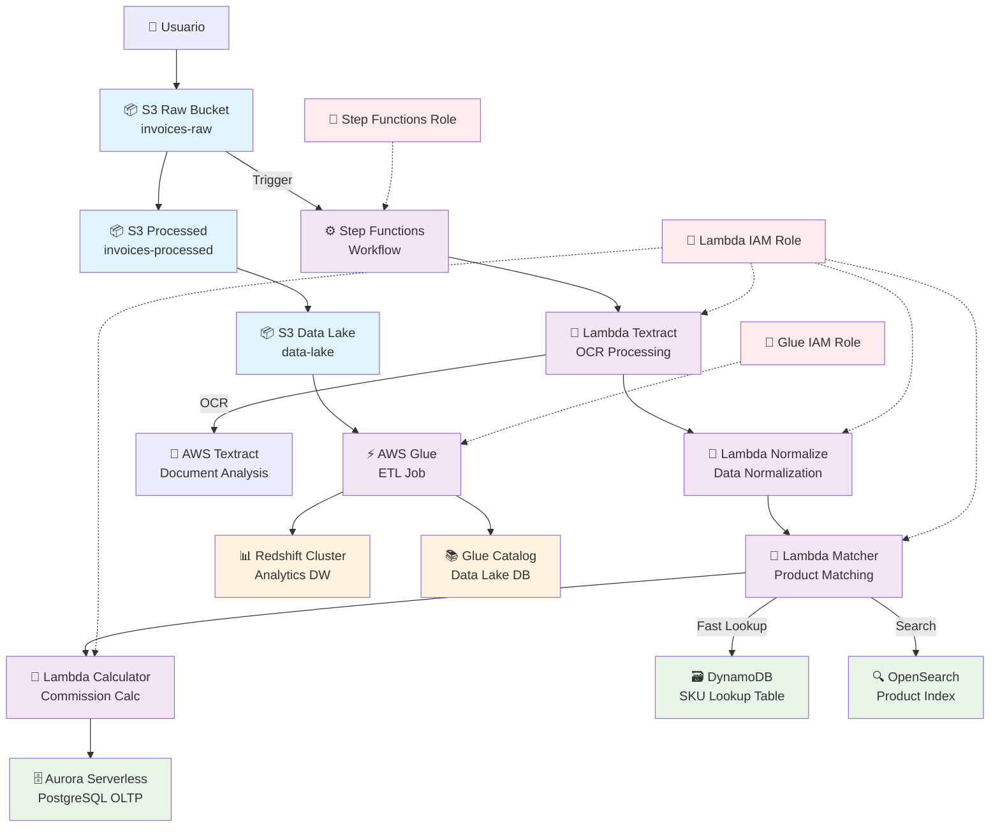

# Diagrama de Infraestructura - Sistema de Procesamiento de Facturas

## Componentes Principales

### 🔄 Flujo de Procesamiento
1. **Ingesta**: Facturas suben a S3 Raw Bucket
2. **Orquestación**: Step Functions coordina el workflow
3. **OCR**: Lambda + Textract extrae texto de documentos
4. **Normalización**: Lambda procesa y limpia datos
5. **Matching**: Lambda busca productos en DynamoDB/OpenSearch
6. **Cálculo**: Lambda calcula comisiones y métricas
7. **Persistencia**: Datos se guardan en Aurora y S3

### 📊 Capa de Analytics
- **Glue ETL**: Procesa datos de S3 → Redshift
- **Redshift**: Data warehouse para análisis
- **Glue Catalog**: Metadatos del data lake

### 🗄️ Almacenamiento
- **S3 Raw**: Facturas originales
- **S3 Processed**: Datos procesados
- **S3 Data Lake**: Repositorio central
- **DynamoDB**: Lookup rápido de SKUs
- **Aurora**: Base transaccional
- **OpenSearch**: Búsqueda híbrida

### 🔐 Seguridad
- Roles IAM específicos por servicio
- Encriptación en S3 y bases de datos
- Acceso controlado entre servicios

## Características Técnicas

- **Región**: us-east-1
- **Escalabilidad**: Serverless (Lambda, Aurora, Step Functions)
- **Durabilidad**: Versionado S3, backups RDS
- **Monitoreo**: CloudWatch integrado
- **Costos**: Pay-per-use en la mayoría de servicios
