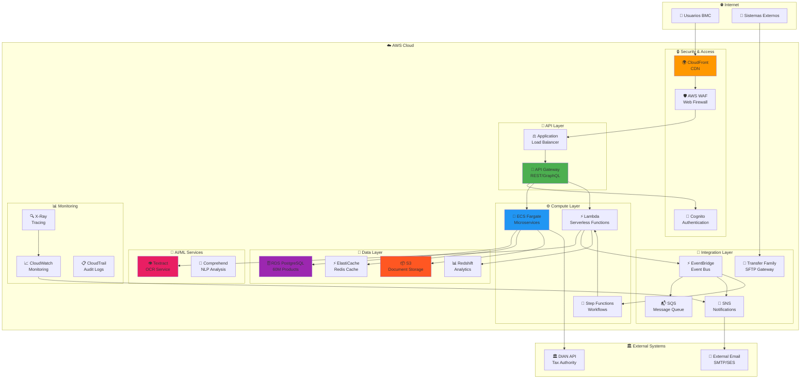
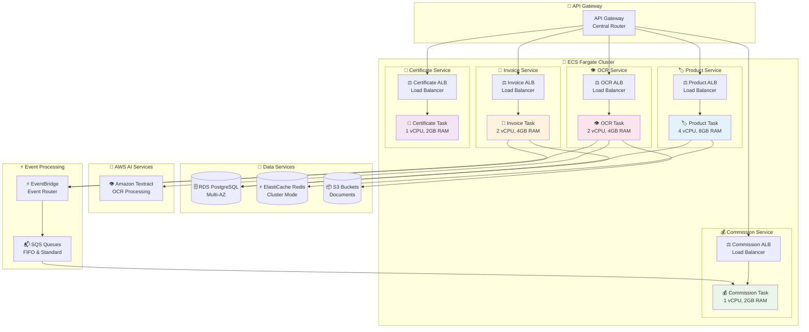
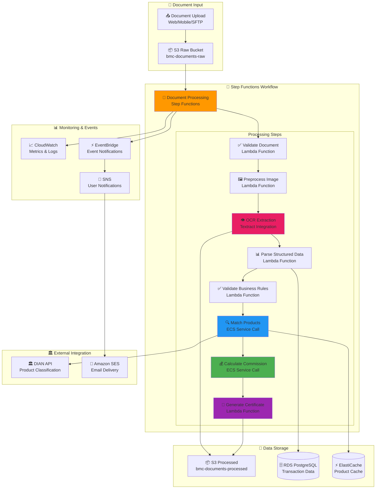
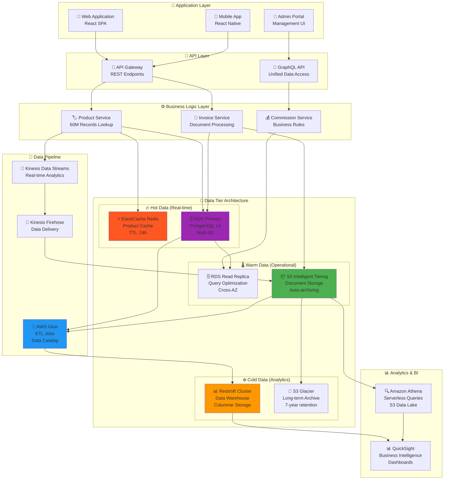
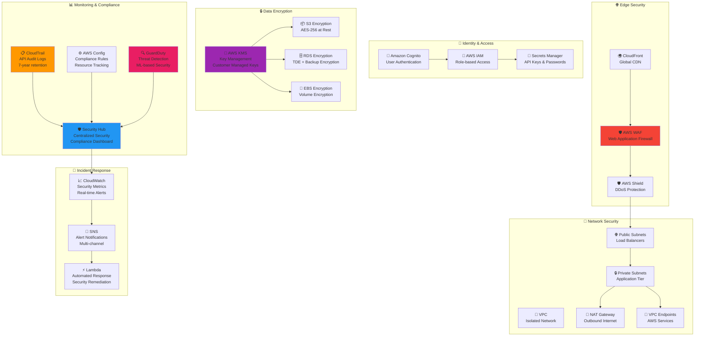
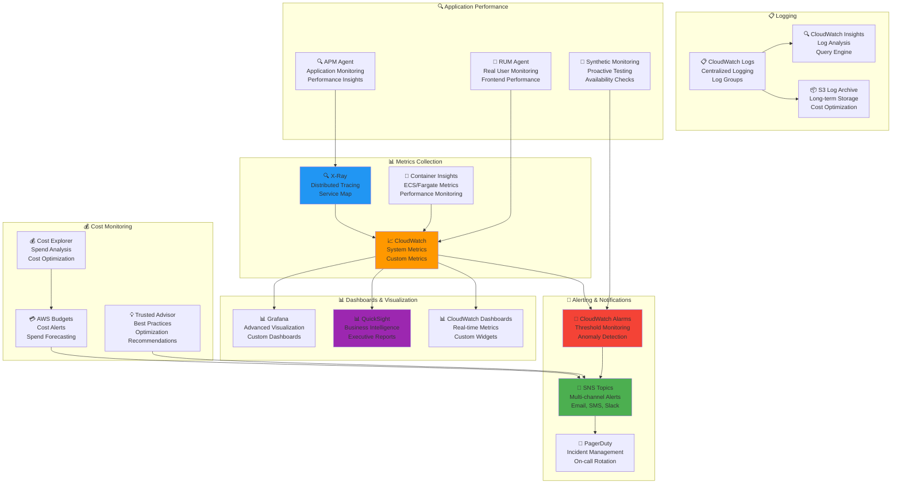

# Diagramas de Arquitectura BMC - AWS con Iconos Mermaid

## 1. Arquitectura General AWS



## 2. Microservicios en ECS Fargate



## 3. Pipeline de Procesamiento de Documentos



## 4. Arquitectura de Datos Multi-Tier



## 5. Seguridad y Compliance



## 6. Monitoreo y Observabilidad



## 7. Disaster Recovery y Backup

```mermaid
graph TB
    subgraph "🌎 Primary Region (us-east-1)"
        subgraph "🏢 Production Environment"
            ProdVPC[🏢 Production VPC<br/>10.0.0.0/16]
            ProdECS[🐳 ECS Fargate<br/>Production Cluster]
            ProdRDS[🗄️ RDS Primary<br/>Multi-AZ PostgreSQL]
            ProdS3[📦 S3 Production<br/>Cross-Region Replication]
            ProdRedshift[📊 Redshift Cluster<br/>Production Analytics]
        end
        
        subgraph "📊 Monitoring"
            CloudWatch[📈 CloudWatch<br/>Health Monitoring]
            Route53Health[🌐 Route 53<br/>Health Checks]
        end
    end
    
    subgraph "🌎 DR Region (us-west-2)"
        subgraph "🔄 Disaster Recovery"
            DRVPC[🏢 DR VPC<br/>10.1.0.0/16]
            DRECS[🐳 ECS Fargate<br/>DR Cluster (Standby)]
            DRRDS[🗄️ RDS Read Replica<br/>Cross-Region]
            DRS3[📦 S3 DR Bucket<br/>Replica Destination]
            DRRedshift[📊 Redshift DR<br/>Snapshot Restore]
        end
    end
    
    subgraph "💾 Backup Strategy"
        subgraph "🔄 Automated Backups"
            RDSBackup[🗄️ RDS Automated Backup<br/>35-day retention<br/>Point-in-time Recovery]
            S3Versioning[📦 S3 Versioning<br/>Object-level Backup<br/>Lifecycle Policies]
            RedshiftSnapshot[📊 Redshift Snapshots<br/>Daily Automated<br/>Cross-region Copy]
        end
        
        subgraph "📦 Long-term Archive"
            S3Glacier[🧊 S3 Glacier<br/>7-year Compliance<br/>Deep Archive]
            BackupVault[🔒 AWS Backup Vault<br/>Centralized Backup<br/>Cross-service]
        end
    end
    
    subgraph "🚨 Failover Automation"
        Route53Failover[🌐 Route 53 Failover<br/>DNS-based Routing<br/>Health Check Triggers]
        LambdaFailover[⚡ Lambda Functions<br/>Automated Failover<br/>Infrastructure Provisioning]
        StepFunctionsOrchestration[🔄 Step Functions<br/>DR Orchestration<br/>Multi-step Recovery]
    end
    
    subgraph "📋 Recovery Procedures"
        RunbookAutomation[📋 Runbook Automation<br/>Systems Manager<br/>Documented Procedures]
        RecoveryTesting[🧪 DR Testing<br/>Quarterly Tests<br/>RTO/RPO Validation]
    end
    
    ProdRDS --> DRRDS
    ProdS3 --> DRS3
    ProdRedshift --> RedshiftSnapshot
    
    ProdRDS --> RDSBackup
    ProdS3 --> S3Versioning
    ProdRedshift --> RedshiftSnapshot
    
    S3Versioning --> S3Glacier
    RDSBackup --> BackupVault
    
    CloudWatch --> Route53Failover
    Route53Health --> Route53Failover
    Route53Failover --> LambdaFailover
    LambdaFailover --> StepFunctionsOrchestration
    
    StepFunctionsOrchestration --> DRECS
    StepFunctionsOrchestration --> DRRedshift
    
    RunbookAutomation --> RecoveryTesting
    
    style ProdRDS fill:#9c27b0
    style DRRDS fill:#673ab7
    style Route53Failover fill:#ff9800
    style LambdaFailover fill:#4caf50
    style S3Glacier fill:#2196f3
```
