# 🏗️ Arquitectura y Diseño de Componentes

## 📋 Resumen Ejecutivo

Sistema MCP Diagram Generator v4.1.0 - Plataforma profesional para generación automática de diagramas técnicos y documentación desde especificaciones de proyectos.

## 🎯 Arquitectura General

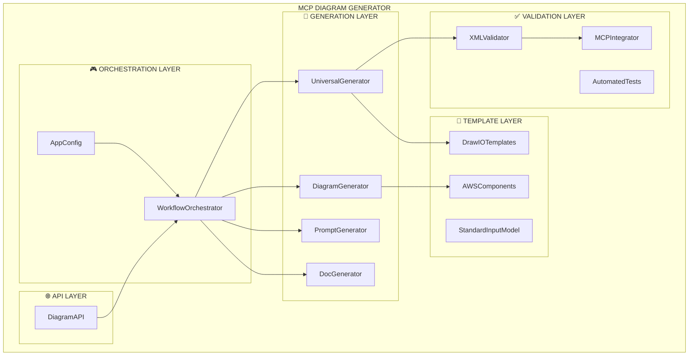

## 🏛️ Principios de Diseño

### 1. Separación de Responsabilidades
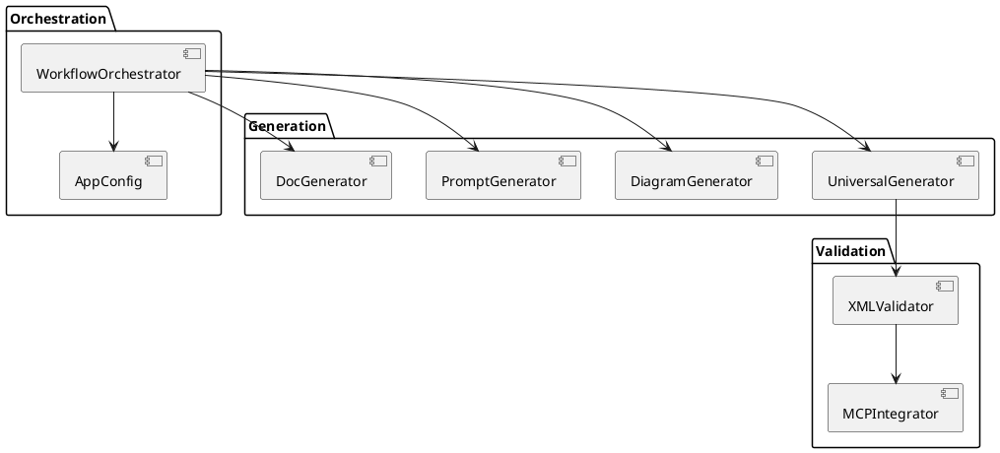

## 📦 Componentes Detallados

### Core Components

#### AppConfig - Configuración Transversal
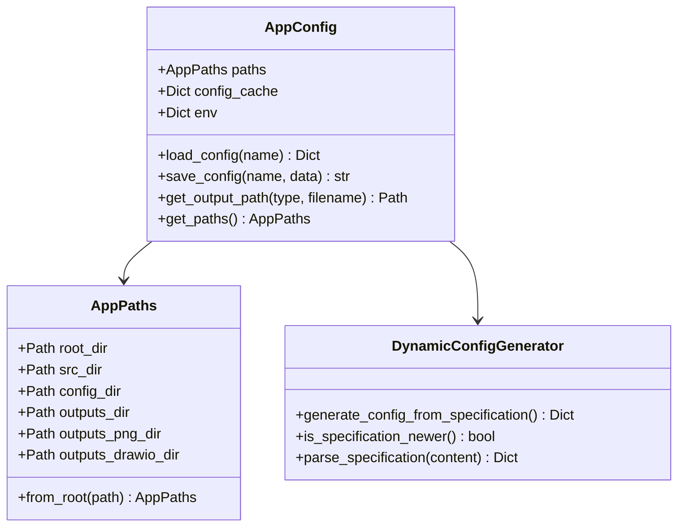

#### WorkflowOrchestrator - Flujo End-to-End
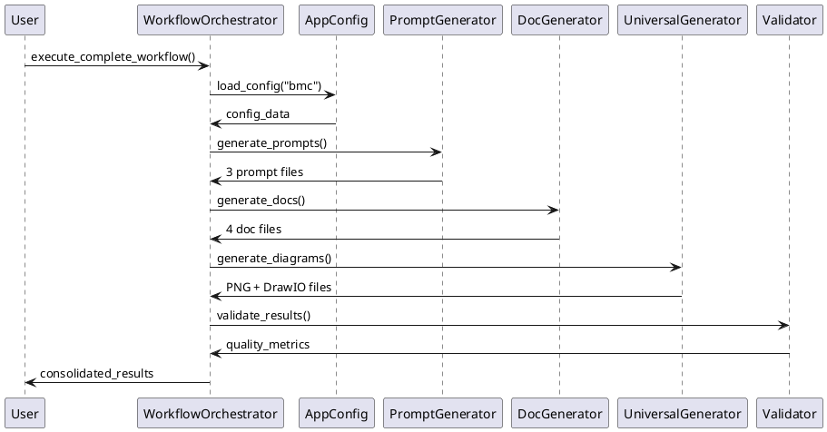

### Generation Components

#### UniversalGenerator - PNG + DrawIO Unificado
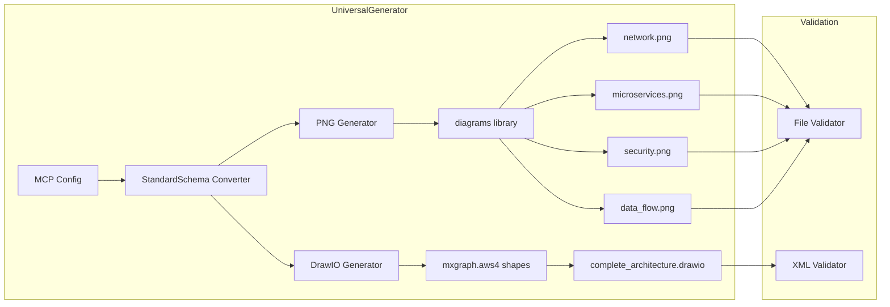

#### DiagramGenerator - PNG Especializado
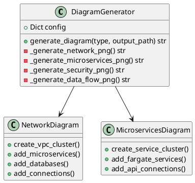

### Validation Components

#### XMLValidator - Calidad DrawIO
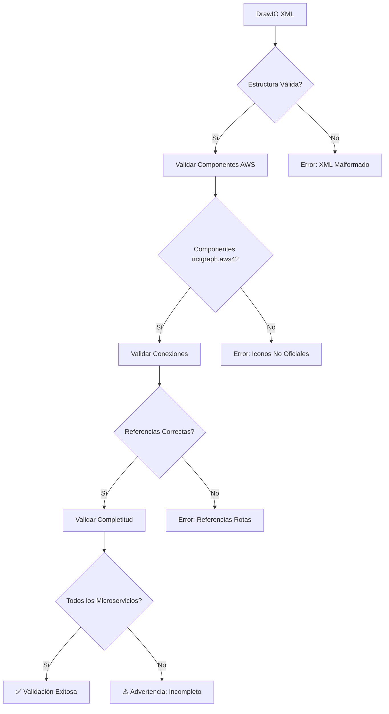

#### MCPIntegrator - Coherencia MCP
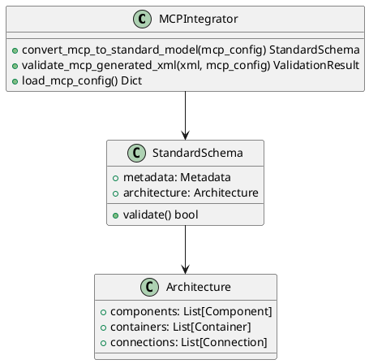

### Template Components

#### DrawIOTemplates - XML Profesional
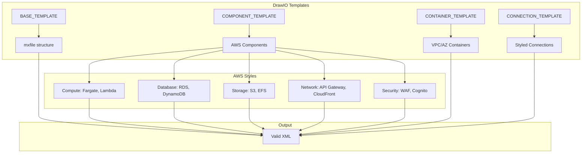

#### AWSComponents - Clases Especializadas
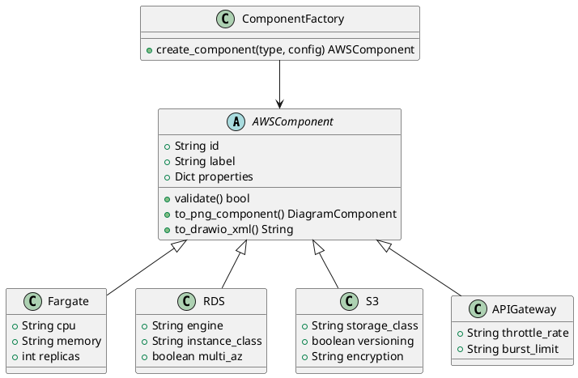

## 🔄 Flujos de Datos

### Flujo Principal de Generación
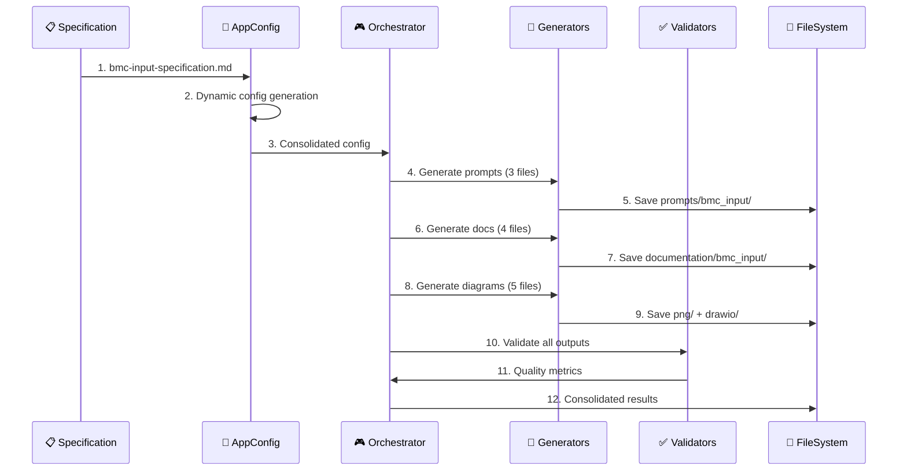

### Flujo de Validación
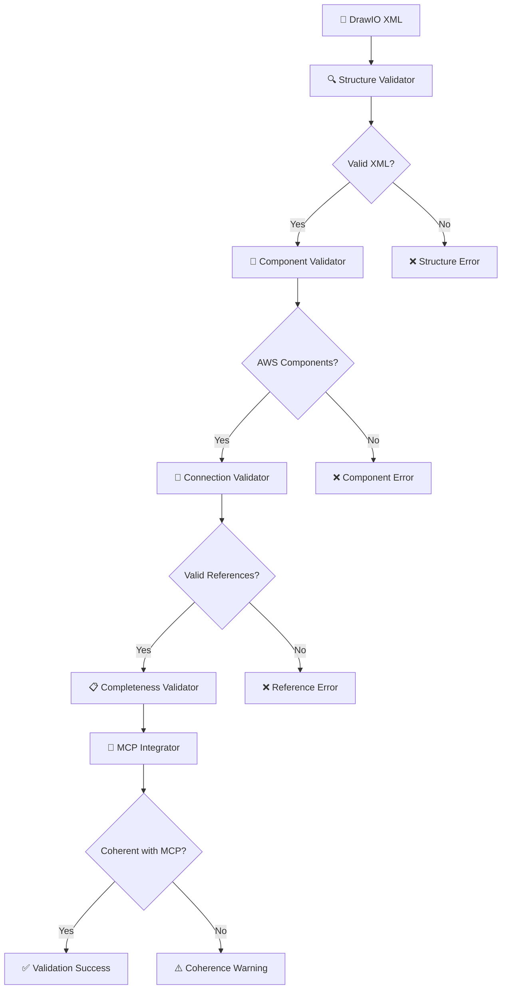

## 📁 Estructura de Outputs

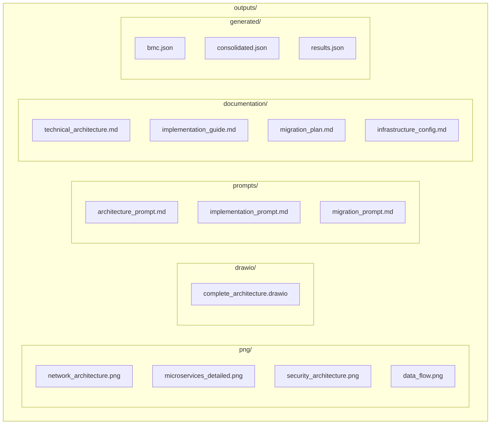

## 🧪 Testing y Calidad

### Tests Automatizados
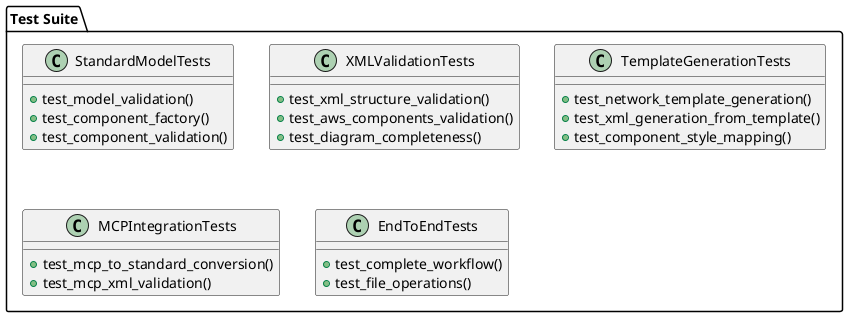

### Métricas de Calidad
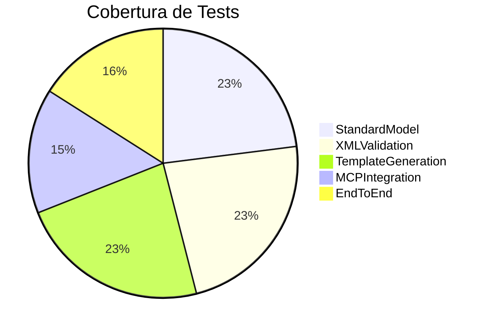

## 🔧 Configuración y Extensibilidad

### Variables de Entorno
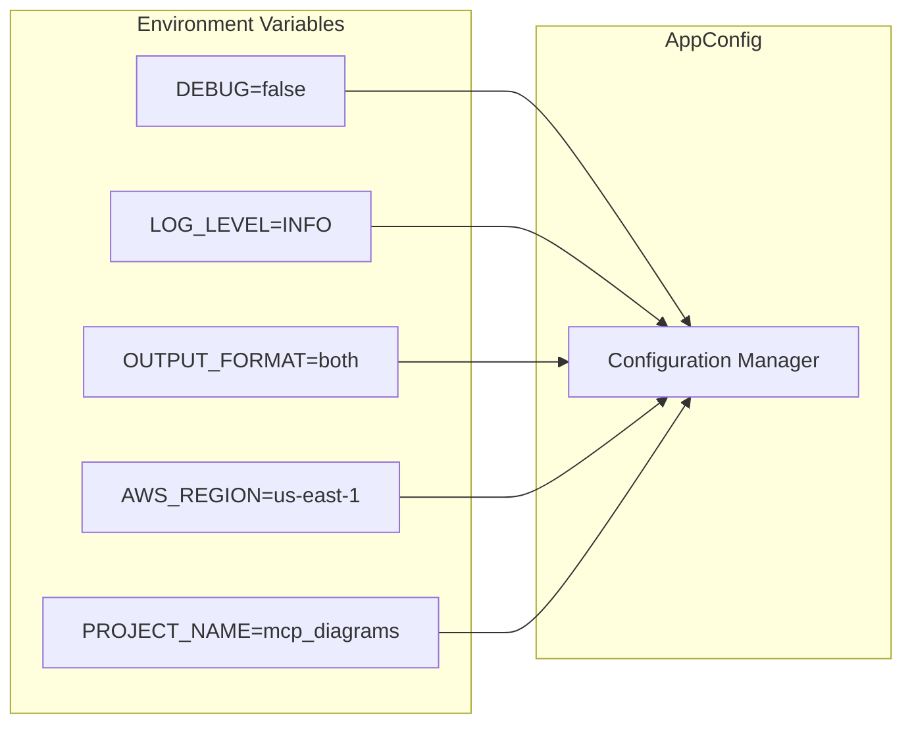

### Extensión Multi-Cloud
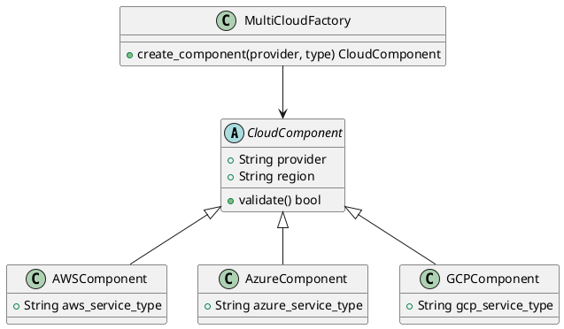

## 📊 Métricas de Performance

```mermaid
gantt
    title Tiempos de Generación
    dateFormat X
    axisFormat %s
    
    section Configuración
    Carga Config     :0, 1s
    
    section Generación
    Prompts (3)      :1s, 2s
    Docs (4)         :2s, 4s
    PNG (4)          :4s, 8s
    DrawIO (1)       :8s, 9s
    
    section Validación
    XML Validation   :9s, 10s
    
    section Total
    Flujo Completo   :0, 10s
```

## 🚀 Roadmap Técnico

### Evolución de Arquitectura
```mermaid
timeline
    title Roadmap de Arquitectura
    
    section v4.1.0 (Actual)
        : Configuración Dinámica
        : Generadores Básicos
        : Validación XML
        : Tests Automatizados
    
    section v4.2.0 (Multi-Cloud)
        : Soporte Azure
        : Soporte GCP
        : Templates Multi-Provider
        : Validación Cross-Cloud
    
    section v4.3.0 (IA Integration)
        : Layout Automático IA
        : Optimización Visual
        : Generación desde Código
        : Análisis Dependencias
    
    section v5.0.0 (Platform)
        : Dashboard Web
        : Colaboración Real-Time
        : Versionado Diagramas
        : Integración CI/CD
```

---

**Esta arquitectura garantiza escalabilidad, mantenibilidad y extensibilidad para evolucionar hacia una plataforma enterprise completa con diagramas editables en código.**
