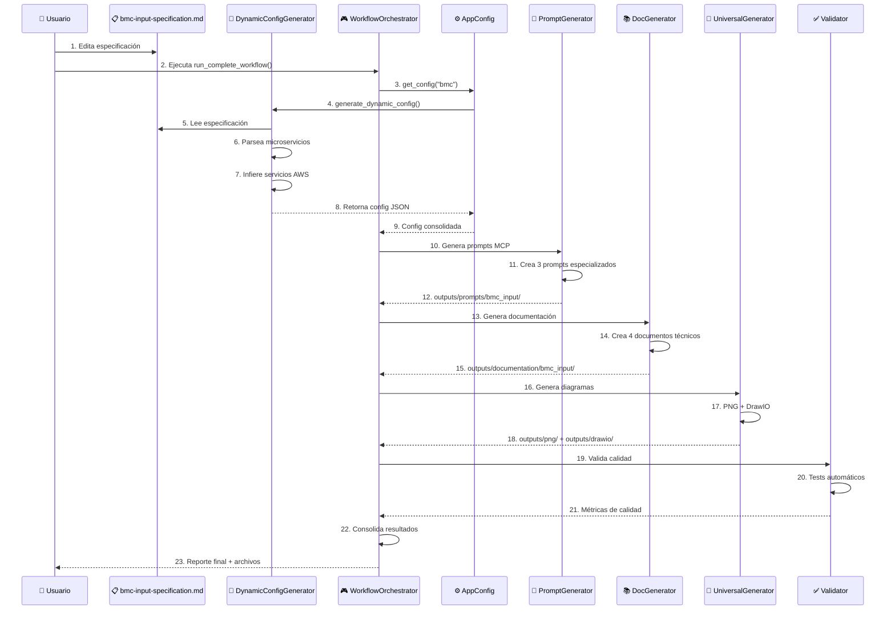
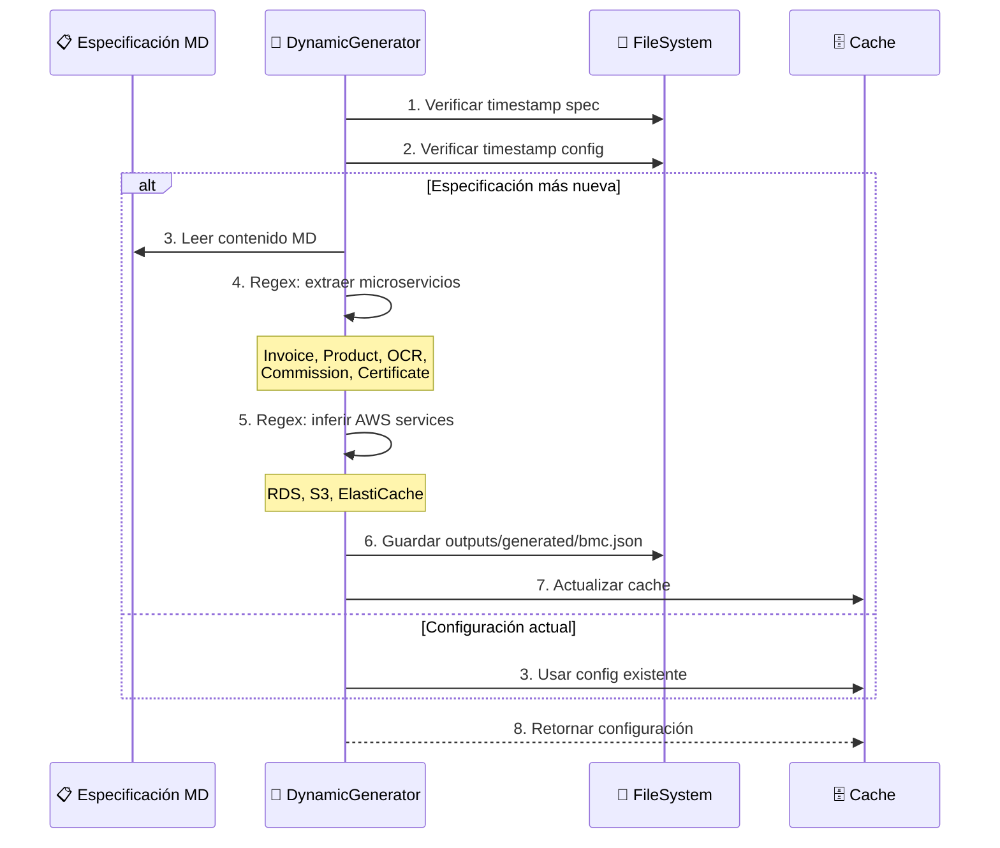
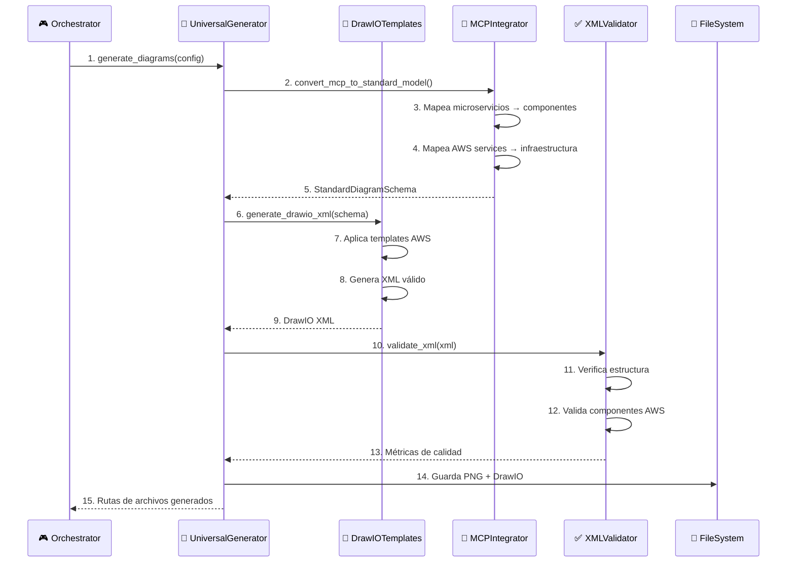
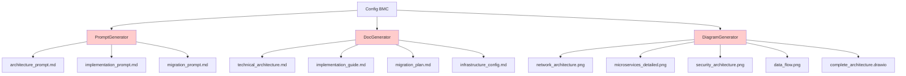

# 🔄 Diagramas de Secuencia - Workflow Completo

## 📋 Proceso End-to-End Actual

### 1. Secuencia Principal - Generación Completa



### 2. Secuencia Detallada - Configuración Dinámica



### 3. Secuencia de Generación de Diagramas



## 📊 Estado Actual vs Esperado

### ✅ Lo que SÍ se está generando:
```
outputs/
├── generated/
│   ├── bmc.json (✅ Config dinámica)
│   └── bmc_input_consolidated.json (✅ Config consolidada)
```

### ❌ Lo que FALTA generar:
```
outputs/
├── png/bmc_input/
│   ├── network_architecture.png (❌ FALTA)
│   ├── microservices_detailed.png (❌ FALTA)
│   ├── security_architecture.png (❌ FALTA)
│   └── data_flow.png (❌ FALTA)
├── drawio/bmc_input/
│   └── complete_architecture.drawio (❌ FALTA)
├── prompts/bmc_input/
│   ├── architecture_prompt.md (❌ FALTA)
│   ├── implementation_prompt.md (❌ FALTA)
│   └── migration_prompt.md (❌ FALTA)
└── documentation/bmc_input/
    ├── technical_architecture.md (❌ FALTA)
    ├── implementation_guide.md (❌ FALTA)
    ├── migration_plan.md (❌ FALTA)
    └── infrastructure_config.md (❌ FALTA)
```

## 🔧 Workflow de Implementación End-to-End

### Fase 1: ✅ COMPLETADA - Configuración Dinámica
- [x] DynamicConfigGenerator funcional
- [x] Parsing desde bmc-input-specification.md
- [x] Generación automática de bmc.json
- [x] Cache inteligente por timestamps

### Fase 2: ❌ PENDIENTE - Generadores Funcionales


### Fase 3: ❌ PENDIENTE - Validación y Calidad
- [ ] XMLValidator para DrawIO
- [ ] Tests automatizados end-to-end
- [ ] Métricas de calidad
- [ ] Reportes de completitud

## 🎯 Plan de Implementación Inmediata

### 1. Arreglar Generadores (CRÍTICO)
```python
# Problema actual: Imports relativos fallan
from ..generators.prompt_generator import MCPPromptGenerator  # ❌ FALLA

# Solución: Imports absolutos
from generators.prompt_generator import MCPPromptGenerator  # ✅ FUNCIONA
```

### 2. Completar Generación de Archivos
```bash
# Objetivo: Generar 11 archivos por proyecto
outputs/bmc_input/
├── 4 PNG (network, microservices, security, data_flow)
├── 1 DrawIO (complete_architecture)
├── 3 Prompts (architecture, implementation, migration)
└── 4 Docs (technical, guide, plan, config)
```

### 3. Validación Automática
```python
# Verificar que todos los archivos se generen
expected_files = [
    "outputs/png/bmc_input/network_architecture.png",
    "outputs/drawio/bmc_input/complete_architecture.drawio",
    "outputs/prompts/bmc_input/architecture_prompt.md",
    # ... 8 archivos más
]
```

## 📋 Checklist de Desarrollo

### ✅ Completado:
- [x] Configuración dinámica desde especificación
- [x] Estructura de archivos limpia
- [x] AppConfig transversal
- [x] Documentación de arquitectura

### 🔄 En Progreso:
- [ ] Arreglar imports en WorkflowOrchestrator
- [ ] Completar generadores de archivos
- [ ] Validación XML DrawIO

### ❌ Pendiente:
- [ ] Generación PNG real (4 diagramas)
- [ ] Generación DrawIO funcional
- [ ] Tests end-to-end completos
- [ ] API REST endpoints

## 🚨 Problemas Críticos Identificados

### 1. Imports Relativos Fallan
```python
# En workflow_orchestrator.py línea ~100
from ..generators.prompt_generator import MCPPromptGenerator  # ❌ FALLA
```

### 2. Generadores No Producen Archivos
- PromptGenerator existe pero no genera archivos
- DocGenerator existe pero no genera archivos  
- DiagramGenerator no se ejecuta correctamente

### 3. Validación Incompleta
- XMLValidator existe pero no se usa
- No hay verificación de archivos generados
- Falta validación de completitud

## 🎯 Próximos Pasos Inmediatos

1. **Arreglar imports** en WorkflowOrchestrator
2. **Completar generadores** para producir archivos reales
3. **Implementar validación** de archivos generados
4. **Crear tests** end-to-end funcionales
5. **Documentar inputs** para cada proceso

---

**El sistema tiene la arquitectura correcta pero los generadores no están produciendo los archivos esperados. Necesitamos completar la implementación de cada generador.**
