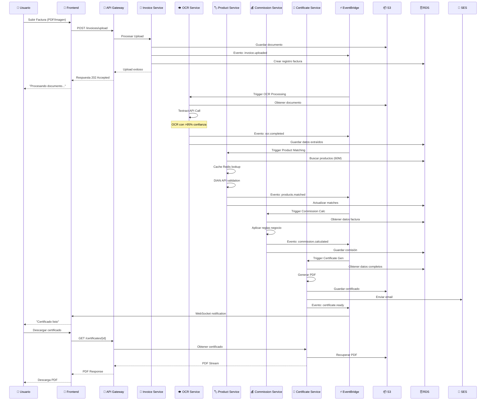
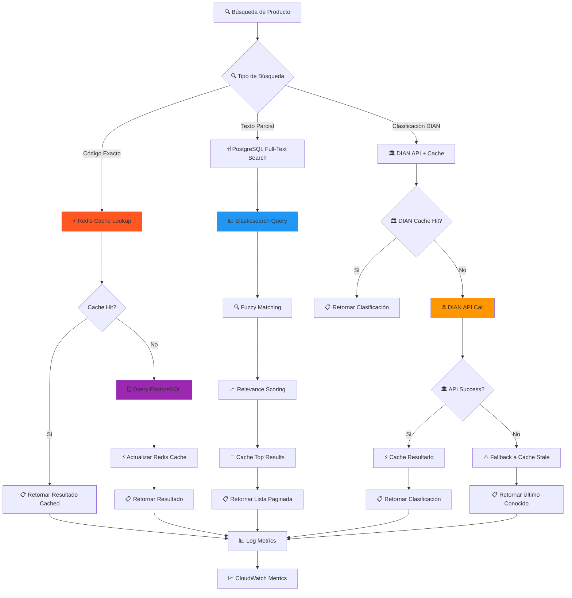
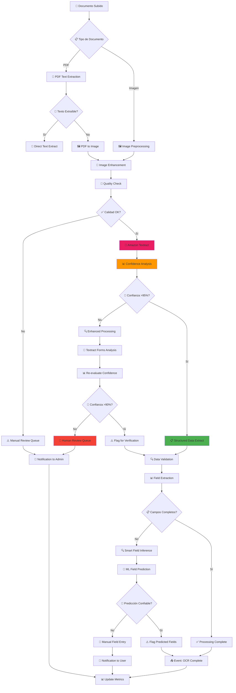
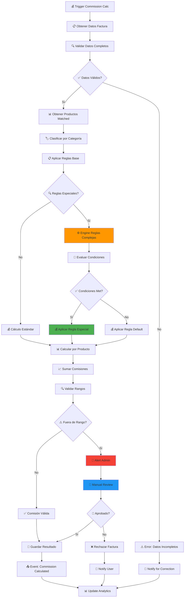
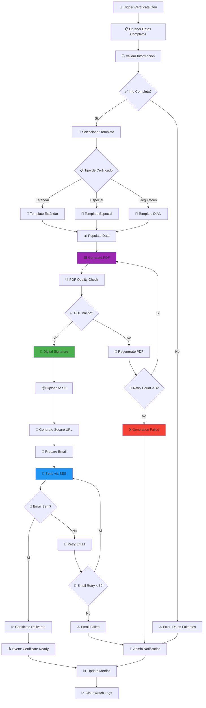
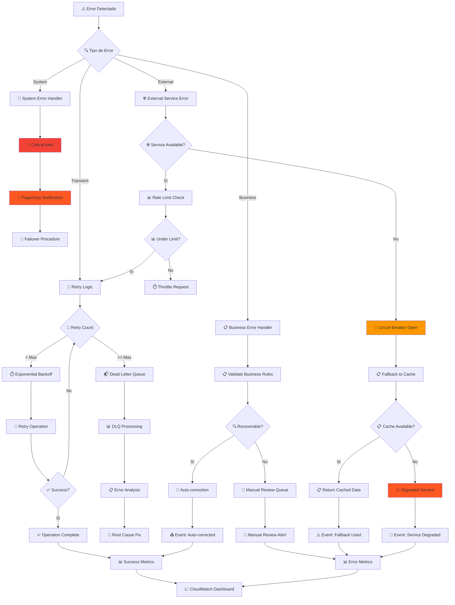
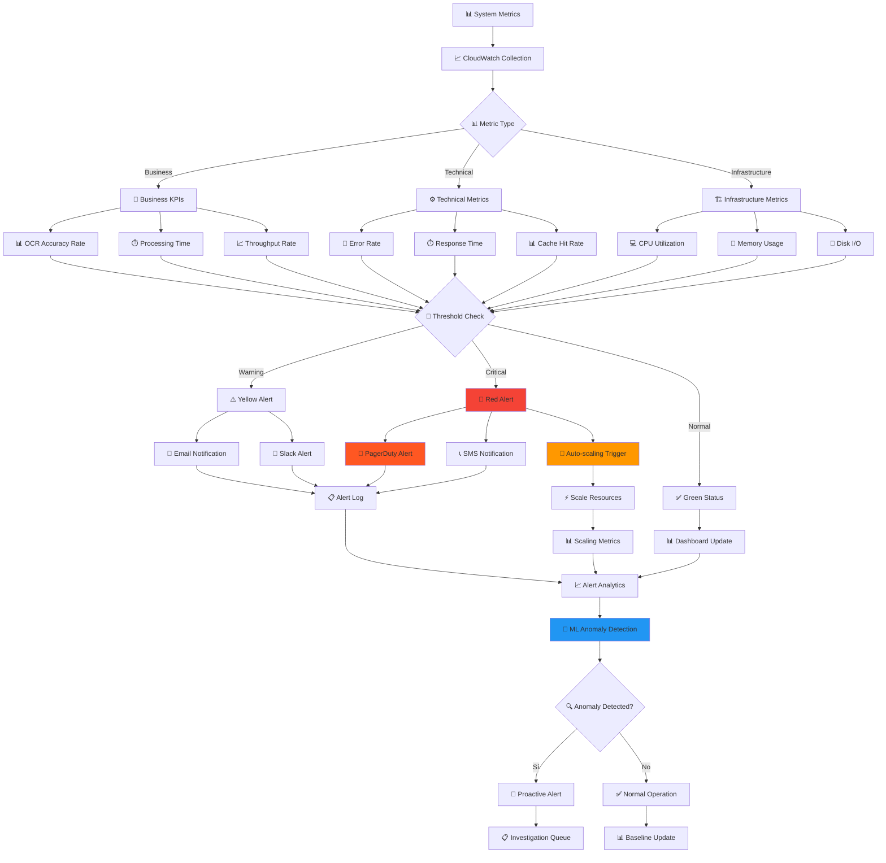

# Flujos de Proceso BMC - Diagramas Mermaid

## 1. Flujo Completo de Procesamiento de Facturas

## 2. Flujo de Búsqueda de Productos (60M Registros)

## 3. Flujo de Procesamiento OCR con Textract

## 4. Flujo de Cálculo de Comisiones

## 5. Flujo de Generación de Certificados

## 6. Flujo de Manejo de Errores y Recuperación

## 7. Flujo de Monitoreo y Alertas

