# Flujos de Proceso BMC - Diagramas Mermaid

## 1. Flujo Completo de Procesamiento de Facturas

```mermaid
sequenceDiagram
    participant U as 👤 Usuario
    participant F as 📱 Frontend
    participant AG as 🚪 API Gateway
    participant IS as 📄 Invoice Service
    participant OS as 👁️ OCR Service
    participant PS as 🏷️ Product Service
    participant CS as 💰 Commission Service
    participant CertS as 📜 Certificate Service
    participant EB as ⚡ EventBridge
    participant S3 as 📦 S3
    participant RDS as 🗄️ RDS
    participant SES as 📧 SES
    
    U->>F: Subir Factura (PDF/Imagen)
    F->>AG: POST /invoices/upload
    AG->>IS: Procesar Upload
    IS->>S3: Guardar documento
    IS->>EB: Evento: invoice.uploaded
    IS->>RDS: Crear registro factura
    IS-->>AG: Upload exitoso
    AG-->>F: Respuesta 202 Accepted
    F-->>U: "Procesando documento..."
    
    EB->>OS: Trigger OCR Processing
    OS->>S3: Obtener documento
    OS->>OS: Textract API Call
    Note over OS: OCR con >95% confianza
    OS->>EB: Evento: ocr.completed
    OS->>RDS: Guardar datos extraídos
    
    EB->>PS: Trigger Product Matching
    PS->>RDS: Buscar productos (60M)
    PS->>PS: Cache Redis lookup
    PS->>PS: DIAN API validation
    PS->>EB: Evento: products.matched
    PS->>RDS: Actualizar matches
    
    EB->>CS: Trigger Commission Calc
    CS->>RDS: Obtener datos factura
    CS->>CS: Aplicar reglas negocio
    CS->>EB: Evento: commission.calculated
    CS->>RDS: Guardar comisión
    
    EB->>CertS: Trigger Certificate Gen
    CertS->>RDS: Obtener datos completos
    CertS->>CertS: Generar PDF
    CertS->>S3: Guardar certificado
    CertS->>SES: Enviar email
    CertS->>EB: Evento: certificate.ready
    
    EB->>F: WebSocket notification
    F-->>U: "Certificado listo"
    U->>F: Descargar certificado
    F->>AG: GET /certificates/{id}
    AG->>CertS: Obtener certificado
    CertS->>S3: Recuperar PDF
    CertS-->>AG: PDF Stream
    AG-->>F: PDF Response
    F-->>U: Descarga PDF
```

## 2. Flujo de Búsqueda de Productos (60M Registros)

```mermaid
flowchart TD
    A[🔍 Búsqueda de Producto] --> B{🔍 Tipo de Búsqueda}
    
    B -->|Código Exacto| C[⚡ Redis Cache Lookup]
    B -->|Texto Parcial| D[🗄️ PostgreSQL Full-Text Search]
    B -->|Clasificación DIAN| E[🏛️ DIAN API + Cache]
    
    C --> F{Cache Hit?}
    F -->|Sí| G[📋 Retornar Resultado Cached]
    F -->|No| H[🗄️ Query PostgreSQL]
    
    D --> I[📊 Elasticsearch Query]
    I --> J[🔍 Fuzzy Matching]
    J --> K[📈 Relevance Scoring]
    
    E --> L{🏛️ DIAN Cache Hit?}
    L -->|Sí| M[📋 Retornar Clasificación]
    L -->|No| N[🌐 DIAN API Call]
    
    H --> O[⚡ Actualizar Redis Cache]
    O --> P[📋 Retornar Resultado]
    
    K --> Q[🔄 Cache Top Results]
    Q --> R[📋 Retornar Lista Paginada]
    
    N --> S{🏛️ API Success?}
    S -->|Sí| T[⚡ Cache Resultado]
    S -->|No| U[⚠️ Fallback a Cache Stale]
    
    T --> V[📋 Retornar Clasificación]
    U --> W[📋 Retornar Último Conocido]
    
    G --> X[📊 Log Metrics]
    P --> X
    R --> X
    V --> X
    W --> X
    
    X --> Y[📈 CloudWatch Metrics]
    
    style C fill:#ff5722
    style H fill:#9c27b0
    style I fill:#2196f3
    style N fill:#ff9800
```

## 3. Flujo de Procesamiento OCR con Textract

```mermaid
flowchart TD
    A[📄 Documento Subido] --> B{📋 Tipo de Documento}
    
    B -->|PDF| C[📄 PDF Text Extraction]
    B -->|Imagen| D[🖼️ Image Preprocessing]
    
    C --> E{📝 Texto Extraíble?}
    E -->|Sí| F[📝 Direct Text Extract]
    E -->|No| G[🖼️ PDF to Image]
    
    D --> H[🔧 Image Enhancement]
    G --> H
    
    H --> I[📐 Quality Check]
    I --> J{✅ Calidad OK?}
    
    J -->|No| K[⚠️ Manual Review Queue]
    J -->|Sí| L[🤖 Amazon Textract]
    
    L --> M[📊 Confidence Analysis]
    M --> N{🎯 Confianza >95%?}
    
    N -->|No| O[🔍 Enhanced Processing]
    N -->|Sí| P[📋 Structured Data Extract]
    
    O --> Q[🤖 Textract Forms Analysis]
    Q --> R[📊 Re-evaluate Confidence]
    R --> S{🎯 Confianza >90%?}
    
    S -->|No| T[👤 Human Review Queue]
    S -->|Sí| U[⚠️ Flag for Verification]
    
    P --> V[🔍 Data Validation]
    U --> V
    
    V --> W[📊 Field Extraction]
    W --> X{📋 Campos Completos?}
    
    X -->|No| Y[🔍 Smart Field Inference]
    X -->|Sí| Z[✅ Processing Complete]
    
    Y --> AA[🤖 ML Field Prediction]
    AA --> BB{🎯 Predicción Confiable?}
    
    BB -->|No| CC[👤 Manual Field Entry]
    BB -->|Sí| DD[⚠️ Flag Predicted Fields]
    
    Z --> EE[📤 Event: OCR Complete]
    DD --> EE
    
    K --> FF[📧 Notification to Admin]
    T --> FF
    CC --> GG[📧 Notification to User]
    
    EE --> HH[📊 Update Metrics]
    FF --> HH
    GG --> HH
    
    style L fill:#e91e63
    style M fill:#ff9800
    style P fill:#4caf50
    style T fill:#f44336
```

## 4. Flujo de Cálculo de Comisiones

```mermaid
flowchart TD
    A[💰 Trigger Commission Calc] --> B[📋 Obtener Datos Factura]
    
    B --> C[🔍 Validar Datos Completos]
    C --> D{✅ Datos Válidos?}
    
    D -->|No| E[⚠️ Error: Datos Incompletos]
    D -->|Sí| F[📊 Obtener Productos Matched]
    
    F --> G[🏷️ Clasificar por Categoría]
    G --> H[📋 Aplicar Reglas Base]
    
    H --> I{🔍 Reglas Especiales?}
    I -->|Sí| J[⚙️ Engine Reglas Complejas]
    I -->|No| K[💰 Cálculo Estándar]
    
    J --> L[🧠 Evaluar Condiciones]
    L --> M{✅ Condiciones Met?}
    
    M -->|Sí| N[💰 Aplicar Regla Especial]
    M -->|No| O[💰 Aplicar Regla Default]
    
    K --> P[📊 Calcular por Producto]
    N --> P
    O --> P
    
    P --> Q[📈 Sumar Comisiones]
    Q --> R[🔍 Validar Rangos]
    
    R --> S{⚠️ Fuera de Rango?}
    S -->|Sí| T[🚨 Alert Admin]
    S -->|No| U[✅ Comisión Válida]
    
    T --> V[👤 Manual Review]
    U --> W[💾 Guardar Resultado]
    
    V --> X{👤 Aprobado?}
    X -->|Sí| W
    X -->|No| Y[❌ Rechazar Factura]
    
    W --> Z[📤 Event: Commission Calculated]
    Y --> AA[📧 Notify User]
    
    Z --> BB[📊 Update Analytics]
    AA --> BB
    
    E --> CC[📧 Notify for Correction]
    CC --> BB
    
    style J fill:#ff9800
    style N fill:#4caf50
    style T fill:#f44336
    style V fill:#2196f3
```

## 5. Flujo de Generación de Certificados

```mermaid
flowchart TD
    A[📜 Trigger Certificate Gen] --> B[📋 Obtener Datos Completos]
    
    B --> C[🔍 Validar Información]
    C --> D{✅ Info Completa?}
    
    D -->|No| E[⚠️ Error: Datos Faltantes]
    D -->|Sí| F[📄 Seleccionar Template]
    
    F --> G{📋 Tipo de Certificado}
    G -->|Estándar| H[📄 Template Estándar]
    G -->|Especial| I[📄 Template Especial]
    G -->|Regulatorio| J[📄 Template DIAN]
    
    H --> K[📊 Populate Data]
    I --> K
    J --> K
    
    K --> L[🖼️ Generate PDF]
    L --> M[🔍 PDF Quality Check]
    
    M --> N{✅ PDF Válido?}
    N -->|No| O[🔄 Regenerate PDF]
    N -->|Sí| P[🔐 Digital Signature]
    
    O --> Q{🔄 Retry Count < 3?}
    Q -->|Sí| L
    Q -->|No| R[❌ Generation Failed]
    
    P --> S[📦 Upload to S3]
    S --> T[🔗 Generate Secure URL]
    
    T --> U[📧 Prepare Email]
    U --> V[📨 Send via SES]
    
    V --> W{📧 Email Sent?}
    W -->|No| X[🔄 Retry Email]
    W -->|Sí| Y[✅ Certificate Delivered]
    
    X --> Z{🔄 Email Retry < 3?}
    Z -->|Sí| V
    Z -->|No| AA[⚠️ Email Failed]
    
    Y --> BB[📤 Event: Certificate Ready]
    AA --> CC[📧 Admin Notification]
    R --> CC
    E --> CC
    
    BB --> DD[📊 Update Metrics]
    CC --> DD
    
    DD --> EE[📈 CloudWatch Logs]
    
    style L fill:#9c27b0
    style P fill:#4caf50
    style V fill:#2196f3
    style R fill:#f44336
```

## 6. Flujo de Manejo de Errores y Recuperación

```mermaid
flowchart TD
    A[⚠️ Error Detectado] --> B{🔍 Tipo de Error}
    
    B -->|Transient| C[🔄 Retry Logic]
    B -->|Business| D[📋 Business Error Handler]
    B -->|System| E[🚨 System Error Handler]
    B -->|External| F[🌐 External Service Error]
    
    C --> G{🔄 Retry Count}
    G -->|< Max| H[⏱️ Exponential Backoff]
    G -->|>= Max| I[📬 Dead Letter Queue]
    
    H --> J[🔄 Retry Operation]
    J --> K{✅ Success?}
    K -->|Sí| L[✅ Operation Complete]
    K -->|No| G
    
    D --> M[📋 Validate Business Rules]
    M --> N{🔍 Recoverable?}
    N -->|Sí| O[🔧 Auto-correction]
    N -->|No| P[👤 Manual Review Queue]
    
    E --> Q[🚨 Critical Alert]
    Q --> R[📧 PagerDuty Notification]
    R --> S[🔄 Failover Procedure]
    
    F --> T{🌐 Service Available?}
    T -->|No| U[🔄 Circuit Breaker Open]
    T -->|Sí| V[📊 Rate Limit Check]
    
    U --> W[📋 Fallback to Cache]
    W --> X{📋 Cache Available?}
    X -->|Sí| Y[📋 Return Cached Data]
    X -->|No| Z[⚠️ Degraded Service]
    
    V --> AA{📊 Under Limit?}
    AA -->|Sí| C
    AA -->|No| BB[⏱️ Throttle Request]
    
    I --> CC[📊 DLQ Processing]
    CC --> DD[📋 Error Analysis]
    DD --> EE[🔧 Root Cause Fix]
    
    O --> FF[📤 Event: Auto-corrected]
    P --> GG[📧 Manual Review Alert]
    Y --> HH[⚠️ Event: Fallback Used]
    Z --> II[🚨 Event: Service Degraded]
    
    L --> JJ[📊 Success Metrics]
    FF --> JJ
    GG --> KK[📊 Error Metrics]
    HH --> KK
    II --> KK
    
    JJ --> LL[📈 CloudWatch Dashboard]
    KK --> LL
    
    style Q fill:#f44336
    style R fill:#ff5722
    style U fill:#ff9800
    style Z fill:#ff5722
```

## 7. Flujo de Monitoreo y Alertas

```mermaid
flowchart TD
    A[📊 System Metrics] --> B[📈 CloudWatch Collection]
    
    B --> C{📊 Metric Type}
    C -->|Business| D[💼 Business KPIs]
    C -->|Technical| E[⚙️ Technical Metrics]
    C -->|Infrastructure| F[🏗️ Infrastructure Metrics]
    
    D --> G[📊 OCR Accuracy Rate]
    D --> H[⏱️ Processing Time]
    D --> I[📈 Throughput Rate]
    
    E --> J[🚨 Error Rate]
    E --> K[⏱️ Response Time]
    E --> L[📊 Cache Hit Rate]
    
    F --> M[💻 CPU Utilization]
    F --> N[💾 Memory Usage]
    F --> O[💽 Disk I/O]
    
    G --> P{🎯 Threshold Check}
    H --> P
    I --> P
    J --> P
    K --> P
    L --> P
    M --> P
    N --> P
    O --> P
    
    P -->|Normal| Q[✅ Green Status]
    P -->|Warning| R[⚠️ Yellow Alert]
    P -->|Critical| S[🚨 Red Alert]
    
    Q --> T[📊 Dashboard Update]
    
    R --> U[📧 Email Notification]
    R --> V[💬 Slack Alert]
    
    S --> W[📱 PagerDuty Alert]
    S --> X[📞 SMS Notification]
    S --> Y[🚨 Auto-scaling Trigger]
    
    U --> Z[📋 Alert Log]
    V --> Z
    W --> Z
    X --> Z
    
    Y --> AA[⚡ Scale Resources]
    AA --> BB[📊 Scaling Metrics]
    
    Z --> CC[📈 Alert Analytics]
    BB --> CC
    T --> CC
    
    CC --> DD[🤖 ML Anomaly Detection]
    DD --> EE{🔍 Anomaly Detected?}
    
    EE -->|Sí| FF[🚨 Proactive Alert]
    EE -->|No| GG[✅ Normal Operation]
    
    FF --> HH[📋 Investigation Queue]
    GG --> II[📊 Baseline Update]
    
    style S fill:#f44336
    style W fill:#ff5722
    style Y fill:#ff9800
    style DD fill:#2196f3
```

