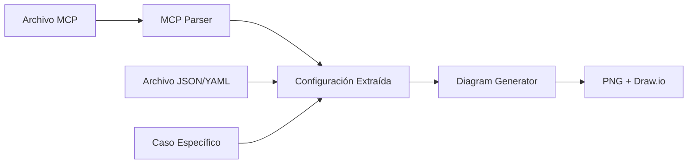

# MCP Diagram Generator - Solución Transversal

## 🎯 Visión General

Solución genérica y reutilizable para generar diagramas de arquitectura AWS desde archivos MCP (Model Context Protocol). Permite crear diagramas profesionales y exactos usando un modelo MCP como fuente de verdad única.

## 🏗️ Arquitectura de la Solución

### Módulos Transversales

```
core/
├── mcp_parser.py          # Parser genérico de archivos MCP
├── diagram_generator.py   # Generador de diagramas AWS
└── mcp_engine.py         # Motor principal de orquestación

cases/
├── bmc_case.py           # Caso específico BMC
├── generic_aws_case.py   # Caso genérico AWS
└── custom_case.py        # Plantilla para casos personalizados

docs/
├── mcp-aws-model.md      # Modelo MCP para AWS
├── mcp-diagrams-architecture.md  # MCP específico BMC
└── templates/            # Plantillas MCP reutilizables
```

### Flujo de Procesamiento



## 🚀 Casos de Uso Implementados

### 1. BMC Case (Bolsa Mercantil de Colombia)
```bash
python3 cases/bmc_case.py
```

**Características:**
- 60M productos en PostgreSQL
- 5 microservicios ECS Fargate
- OCR >95% con Textract
- 10K facturas/hora
- Auto-scaling 2-15 instancias

### 2. Generic AWS Case
```bash
python3 cases/generic_aws_case.py
```

**Características:**
- Arquitectura AWS estándar
- 3 microservicios genéricos
- RDS + ElastiCache + S3
- Configuración reutilizable

### 3. Custom Case (Plantilla)
```bash
python3 cases/custom_case.py
```

**Características:**
- Plantilla personalizable
- Configuración por JSON/YAML
- Servicios AWS modulares

## 📋 Modelo MCP para AWS

### Estructura del MCP

```yaml
# Configuración de Microservicios
microservices:
  service_name:
    cpu: 2048
    memory: 4096
    port: 8000
    min_capacity: 2
    max_capacity: 10
    health_check: "/health"

# Servicios AWS
services:
  database:
    type: "rds"
    engine: "postgresql"
    instance_class: "db.r6g.large"
    multi_az: true
  
  cache:
    type: "elasticache"
    engine: "redis"
    node_type: "cache.r6g.large"
  
  storage:
    type: "s3"
    storage_class: "intelligent_tiering"

# Métricas y KPIs
metrics:
  response_time: 
    value: "500"
    unit: "ms"
  throughput:
    value: "1000" 
    unit: "req/s"
  availability:
    value: "99.9"
    unit: "%"
```

### Servicios AWS Soportados

**Compute:**
- ECS Fargate
- Lambda Functions
- Step Functions (futuro)

**Storage:**
- RDS (PostgreSQL, MySQL)
- ElastiCache (Redis)
- S3 (Standard, IA, Glacier)
- Redshift (futuro)

**Network:**
- API Gateway
- CloudFront CDN
- Application Load Balancer
- VPC (futuro)

**Security:**
- Cognito Authentication
- WAF Web Firewall
- KMS Key Management
- Secrets Manager (futuro)

**AI/ML:**
- Textract OCR
- Comprehend NLP (futuro)
- Rekognition (futuro)

**Integration:**
- EventBridge
- SQS Queues
- SNS Notifications
- Transfer Family (futuro)

**Monitoring:**
- CloudWatch
- X-Ray Tracing (futuro)
- CloudTrail (futuro)

## 🔧 Uso de la Solución

### Generación Básica
```bash
# Desde archivo MCP
python3 -m core.mcp_engine docs/mcp-diagrams-architecture.md

# Desde configuración JSON
python3 -m core.mcp_engine config/architecture.json

# Caso específico
python3 cases/bmc_case.py
```

### API Programática
```python
from core.mcp_engine import MCPEngine

# Crear engine
engine = MCPEngine(output_dir="output")

# Cargar y procesar
engine.run("docs/mcp-diagrams-architecture.md", "MyProject")

# Validar configuración
engine.validate_config()

# Obtener resumen
summary = engine.get_config_summary()
```

### Personalización
```python
from core.diagram_generator import DiagramGenerator

# Configuración personalizada
config = {
    "microservices": {...},
    "services": {...}
}

# Generar diagramas
generator = DiagramGenerator(config)
results = generator.generate_all("CustomProject")
```

## 📊 Formatos de Salida

### PNG (Presentaciones)
- **Arquitectura Principal**: Vista completa del sistema
- **Microservicios Detallados**: Pods, tasks, auto-scaling
- **Flujo de Datos**: Procesamiento y almacenamiento
- **Seguridad**: Capas de seguridad y compliance

### Draw.io (Edición Colaborativa)
- **XML Válido**: Compatible con https://app.diagrams.net
- **Iconos Oficiales AWS**: Vectoriales y escalables
- **Grupos Organizados**: Por función y responsabilidad
- **Conexiones Etiquetadas**: Con métricas y capacidades

### SVG (Futuro)
- **Vectorial**: Escalable sin pérdida de calidad
- **Web-friendly**: Integración en documentación web
- **Interactivo**: Tooltips y enlaces (futuro)

## 🎯 Evolución de la Aplicación

### Roadmap v2.1
- [ ] Parser Terraform (main.tf → MCP)
- [ ] Generación desde CloudFormation
- [ ] Soporte para Kubernetes
- [ ] Diagramas interactivos (SVG + JS)

### Roadmap v2.2
- [ ] Validación de arquitectura vs implementación
- [ ] Estimación de costos automática
- [ ] Recomendaciones de optimización
- [ ] Integración con AWS CLI

### Roadmap v3.0
- [ ] IA para optimización de arquitectura
- [ ] Generación automática de IaC
- [ ] Monitoreo en tiempo real
- [ ] Dashboard web interactivo

## 🔄 Contribución y Extensión

### Agregar Nuevo Servicio AWS
```python
# En diagram_generator.py
def _init_aws_services(self):
    return {
        # Servicios existentes...
        "new_service": NewAWSService,
    }
```

### Crear Nuevo Caso de Uso
```python
# cases/new_case.py
from core.mcp_engine import MCPEngine

def run_new_case():
    engine = MCPEngine()
    return engine.run("config/new_config.json", "NewProject")
```

### Personalizar Generador
```python
# Heredar de DiagramGenerator
class CustomGenerator(DiagramGenerator):
    def generate_custom_diagram(self):
        # Lógica personalizada
        pass
```

## 📈 Métricas de la Solución

### Performance
- **Tiempo de generación**: <30 segundos
- **Archivos soportados**: MCP, JSON, YAML
- **Servicios AWS**: 16+ implementados
- **Formatos salida**: PNG, Draw.io, SVG (futuro)

### Escalabilidad
- **Casos de uso**: Ilimitados
- **Configuraciones**: Dinámicas
- **Servicios**: Modulares y extensibles
- **Plantillas**: Reutilizables

### Mantenibilidad
- **Arquitectura modular**: Core + Cases
- **Separación de responsabilidades**: Parser + Generator + Engine
- **Configuración externa**: MCP como fuente de verdad
- **Testing**: Casos de prueba automatizados (futuro)

## 🎉 Beneficios

### Para Arquitectos
- **Diagramas profesionales** desde documentación
- **Consistencia** entre documentación e implementación
- **Reutilización** de patrones y configuraciones
- **Evolución controlada** de la arquitectura

### Para Desarrolladores
- **Automatización** de diagramas técnicos
- **Integración** con pipelines CI/CD
- **Validación** de arquitectura vs código
- **Documentación** siempre actualizada

### Para Organizaciones
- **Estandarización** de arquitecturas
- **Gobierno** de soluciones cloud
- **Reducción de costos** por optimización
- **Aceleración** de proyectos nuevos

---

**🚀 MCP Diagram Generator - Transformando arquitecturas en diagramas profesionales**
