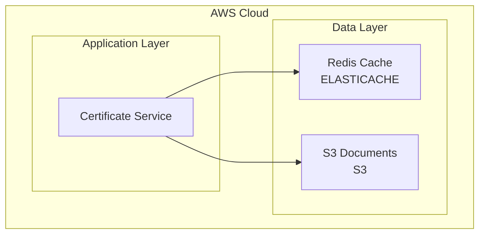

# Arquitectura BMC - Mermaid

```mermaid
graph TB
    subgraph "AWS Cloud"
        subgraph "Application Layer"
            MS1[Certificate Service]
        end

        subgraph "Data Layer"
            AWS1[Redis Cache<br/>ELASTICACHE]
            AWS2[S3 Documents<br/>S3]
        end
    end

    %% Connections
    MS1 --> AWS1
    MS1 --> AWS2
```

## Especificaciones Técnicas

### Certificate Service
- **Función:** Generación de certificados PDF DIAN compliance
- **CPU:** 1024 vCPU
- **Memoria:** 2048 MB

