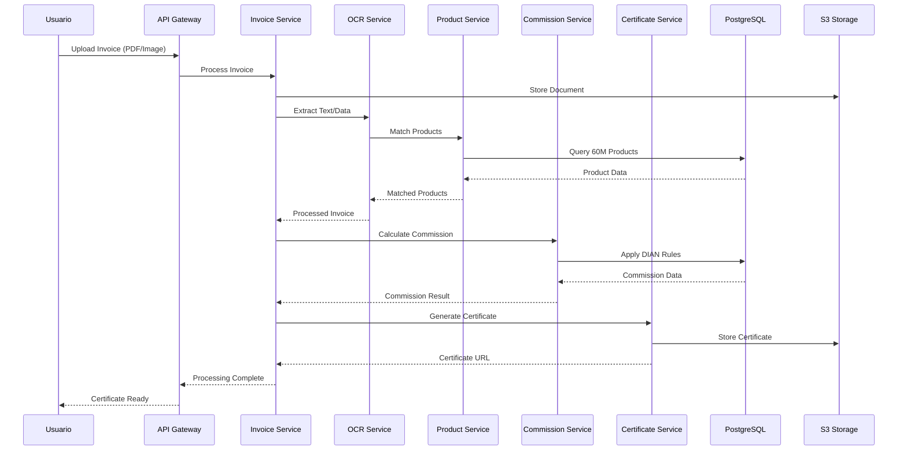

# Flujo de Datos BMC - Mermaid

## Métricas de Performance

- **Throughput:** 10,000 facturas/hora
- **Latencia OCR:** < 5 segundos
- **Lookup productos:** < 300ms
- **Generación certificado:** < 2 segundos

## Volúmenes de Datos

- **Productos:** 60M registros
- **Categorías:** 16,000 tipos
- **Facturas diarias:** ~240,000
