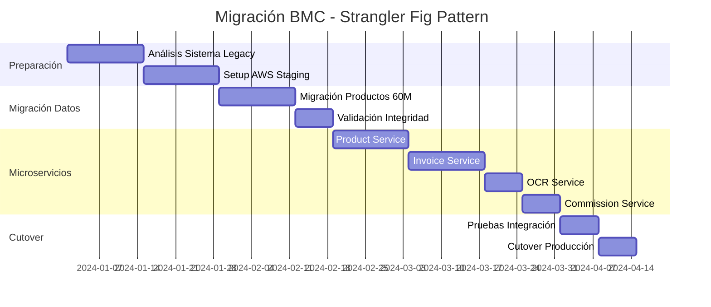
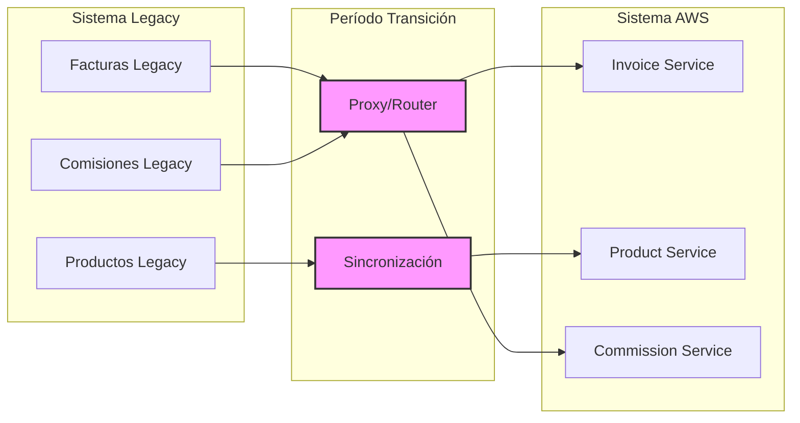

# Plan de Migración BMC - Mermaid

```mermaid
gantt
    title Migración BMC - Strangler Fig Pattern
    dateFormat  YYYY-MM-DD
    section Preparación
    Análisis Sistema Legacy    :prep1, 2024-01-01, 2w
    Setup AWS Staging         :prep2, after prep1, 2w
    
    section Migración Datos
    Migración Productos 60M   :data1, after prep2, 2w
    Validación Integridad     :data2, after data1, 1w
    
    section Microservicios
    Product Service           :ms1, after data2, 2w
    Invoice Service           :ms2, after ms1, 2w
    OCR Service              :ms3, after ms2, 1w
    Commission Service        :ms4, after ms3, 1w
    
    section Cutover
    Pruebas Integración      :cut1, after ms4, 1w
    Cutover Producción       :cut2, after cut1, 1w
```

## Estrategia de Migración

```mermaid
graph LR
    subgraph "Sistema Legacy"
        L1[Facturas Legacy]
        L2[Productos Legacy]
        L3[Comisiones Legacy]
    end
    
    subgraph "Período Transición"
        T1[Proxy/Router]
        T2[Sincronización]
    end
    
    subgraph "Sistema AWS"
        A1[Invoice Service]
        A2[Product Service]
        A3[Commission Service]
    end
    
    L1 --> T1
    L2 --> T2
    L3 --> T1
    
    T1 --> A1
    T2 --> A2
    T1 --> A3
    
    style T1 fill:#f9f,stroke:#333,stroke-width:2px
    style T2 fill:#f9f,stroke:#333,stroke-width:2px
```

## Criterios de Rollback

- Error rate > 5%
- Latencia > 5000ms
- Disponibilidad < 99%
