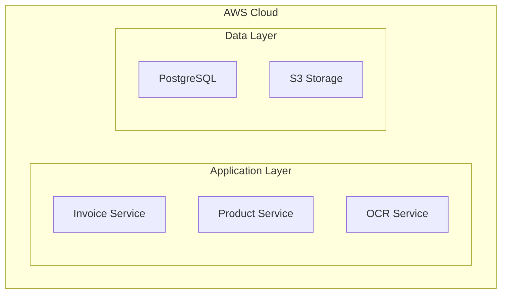
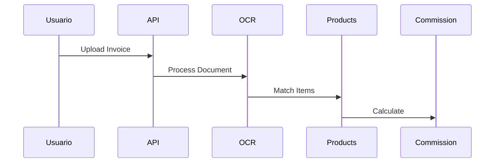

# Prompt de Arquitectura MCP - BMC Bolsa Comisionista

## Contexto del Sistema
**Proyecto:** BMC Bolsa Comisionista
**Tipo:** Sistema Regulatorio
**Función:** Procesamiento de facturas

## Microservicios Identificados

### Certificate Service
- **Función de negocio:** Generación de certificados PDF DIAN compliance
- **CPU:** 1024 
- **Memoria:** 2048MB
- **Escalamiento:** 1-5 instancias

## Servicios AWS Requeridos

### Redis Cache
- **Tipo:** elasticache
- **Propósito:** Cache de productos frecuentes y sesiones

### S3 Documents
- **Tipo:** s3
- **Propósito:** Almacenamiento de facturas PDF/imágenes

## Prompt para Arquitecto

Basado en esta información, diseña una arquitectura AWS que:

1. **Cumpla con regulaciones DIAN** para el procesamiento de facturas
2. **Soporte 60M productos** con alta disponibilidad
3. **Procese 10,000 facturas/hora** con escalamiento automático
4. **Integre OCR** para procesamiento de imágenes/PDFs
5. **Mantenga compliance** regulatorio y auditabilidad

### Consideraciones Técnicas
- Usar patrones de microservicios
- Implementar cache distribuido
- Configurar monitoreo y alertas
- Diseñar para multi-AZ
- Incluir backup y disaster recovery

### Diagramas Requeridos
Genera los siguientes diagramas en **Mermaid**:

1. **Diagrama de Arquitectura**


2. **Diagrama de Flujo de Datos**


3. **Diagrama de Migración**
```mermaid
gantt
    title Migration Plan
    section Phase 1
    Infrastructure Setup: 2w
    section Phase 2
    Data Migration: 3w
```

Los diagramas Mermaid están disponibles en: `outputs/mcp/diagrams/bmc_input/mermaid/`

Generado: 2025-09-19 22:30:03
